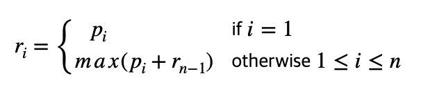

## 목차

1. [Rod cuttiing problem](#rod-cuttiing-problem)
2. [Recursive structure](#recursive-structure)
3. [Optimal substructure](#optimal-substructure)
4. [DP solution](#dp-solution)
5. [References](#references)

---

## Rod cuttiing problem
N인치 길이의 파이프가 주어진다. 파이프를 자르고 나서, 파이프의 가격을 Pi(i = 1, 2, 3, ..., n)이라 할때, 최대 수익이 되도록하는 파이프의 길이가 몇인지 구하는 문제이다.

+ Input: 길이 N의 파이프와 가격 Pi에 대한 테이블 (i = 1, 2, 3, ..., n)
    + 2n-1개의 경우의 수가 있다.
+ Output: 자른 파이프 각각의 수익을 합했을 때의 최대 수익
    + ri는 길이 i를 가지는 파이프의 최대 수익이다.
    + 각 파이프의 최대 수익의 합으로 표현된다.

## Recursive structure
+ 파이프를 1번 자르면 2개의 sub-problem이 생긴다.(ri와 rn-1) 
+ 파이프를 자를 때, 왼쪽 또는 오른쪽을 기준으로 자를 수 있다. 결과는 똑같으므로 중복을 방지하기 위해서 한 쪽 방향만을 자른다고 가정한다.
+ 왼쪽을 기준으로 파이프를 자른다고 가정하자. 왼쪽 파이프는 앞으로 건드리지 않고, 오른쪽 파이프만 다시 recursive structure를 가진다.

## Optimal substructure
Recursive structure 미적용: rn = max(pn, r1 + rn-1, r2 + rn-2, ... , rn-1 + r1)

Recursive structure 적용: ri = max(pi + rn-1) (1 <= i <= n)

### Recursive pseudocode

    CUT-ROD(p, n)
    if n == 0
        return 0
    q = -∞
    for i = 1 to n
        q = max(q, p[i] + CUT-ROD(p, n-1))
    return q

=> 중복을 피할 수 없다.

=> T(n) = 2n 이다.

## DP solution
+ Subproblems는 중복 없이 1번만 해결한다.
+ Subproblem의 solution은 table에 저장한다.
+ 작은 문제로부터 큰 문제를 해결한다.
+ 이전의 해결된 값은 table에 저장되어 있으므로, table를 활용한다.

### DP pseudocode

    BOTTOM-UP-CUT-ROD(p, n)
    let r[0..n] be a new array
    r[0] = 0
    for j = 1 to n
        q = -∞
        for i = 1 to j
            q = max(q, p[i] + r[j-i])
        r[j] = q
    return r[n]

### Performance
BOTTOM-UP-CUT-ROD(p, n)은 θ(n2)이다. (2중 반복문)

### Extended DP pseudocode

    EXTENDED-BOTTOM-UP-CUT-ROD(p, n)
    let r[0..n] and s[1..n] be a new array
    r[0] = 0
    for j = 1 to n
        q = -∞
        for i = 1 to j
            if q < p[i] + r[j-i]
                q = p[i] + r[j-i]
                s[j] = i
        r[j] = q
    return r[n]

    PRINT-CUT-ROD-SOLUTION(p, n)
    while n > 0
        print s[n]
        n = n - s[n]

## References
> + 2022 봄 알고리즘 수업