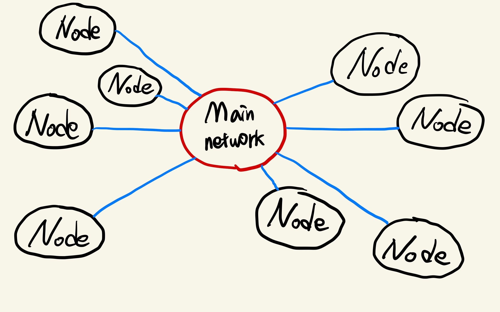
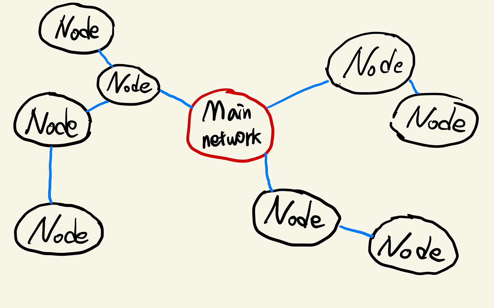
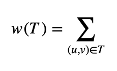
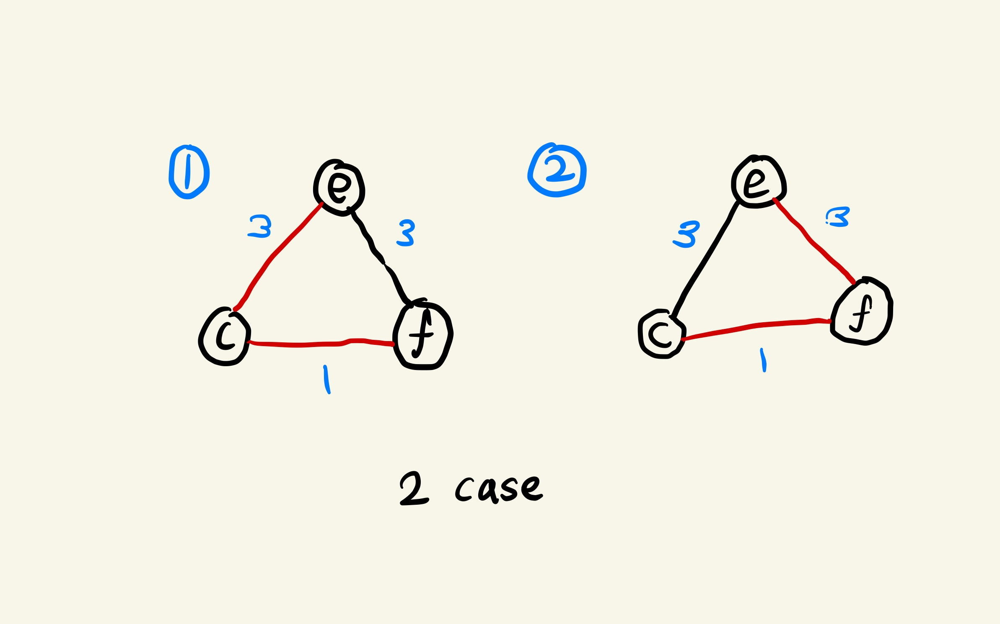
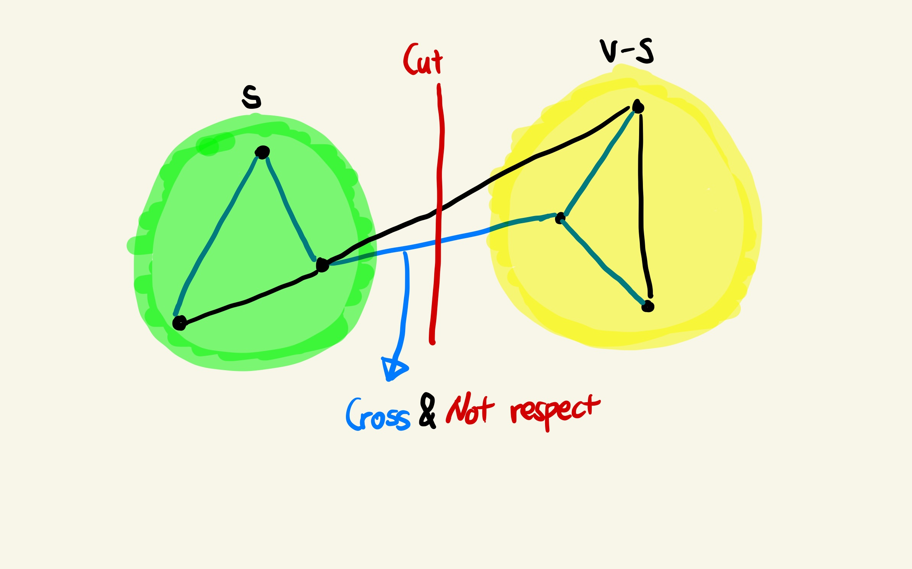
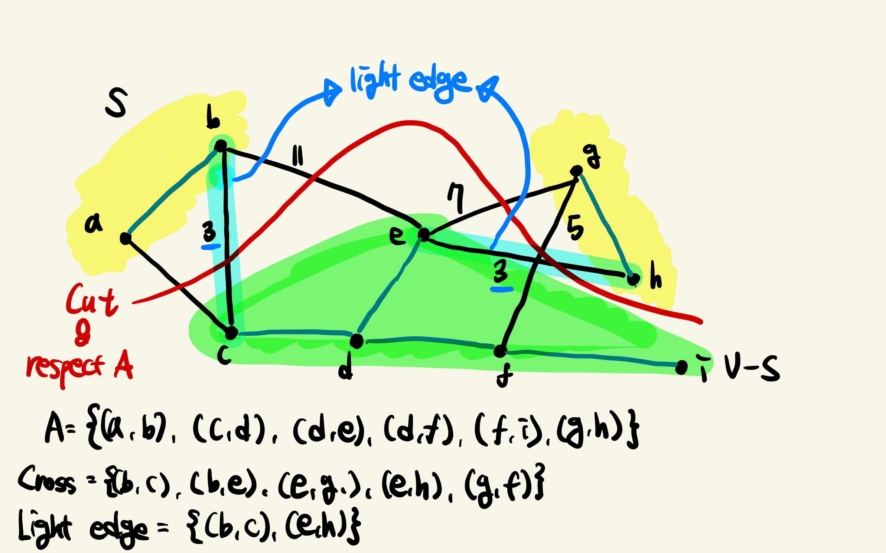
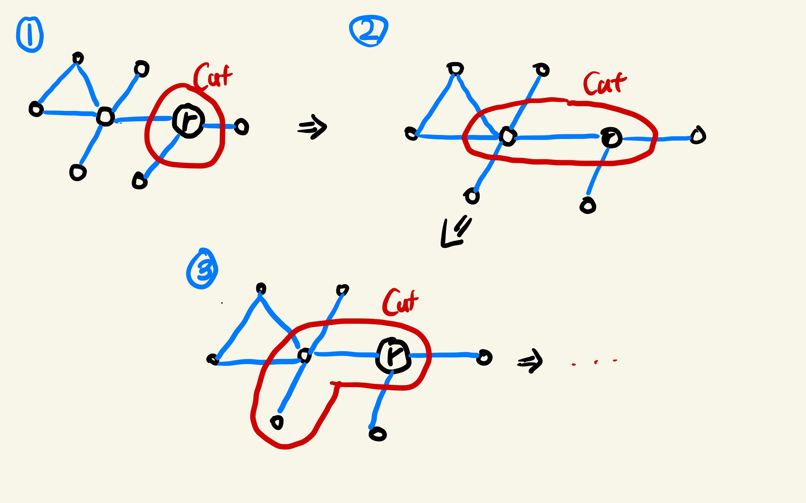

## 목차

1. [Minimum spanning trees](#minimum-spanning-trees)
2. [Generic MST algorithm](#generic-mst-algorithm)
3. [Finding a safe edge](#finding-a-safe-edge)
4. [Prim's algorithm](#prims-algorithm)
5. [References](#references)

---

## Minimum spanning trees


해당 네트워크는 메인 네트워크가 각 노드까지 메세지를 직접 전달하는 데 비용이 비싸다. 따라서 아래와 같이 근접 노드에만 메세지를 전달하고, 메세지를 수신한 노드는 또 다시 근접 노드에 메세지를 전달한다.



### Input
연결되어 있지만 방향성이 없는 그래프 G = (V,E)가 주어진다. 각 Edge는 weight (or cost or length)를 가진다.

### Output
Cycle이 만들어지지 않는 Edge들로 이루어진 subset T가 만들어진다. T는 다음을 만족하면 MST라고 정의한다.
+ T에 있는 Edge를 모두 연결했을 때, 모든 Node가 연결되어야 한다.
    + T는 a spanning tree이다.
+ Edge의 cost 합은 가능한 작아야한다.
+ Output은 여러 개일 수 있다.



Ex) T = {(a, b), (a, g), ... } \
여기서 그래프 G는 방향성이 없는 그래프이기 때문에 (a, b)나 (b, a)는 같다.

### Weight
Weight w(u,v)는 (u, v) ∈ E를 만족하는 각 edge에 대한 가중치이다.

### MST
+ |V|-1 개의 edge를 가진다.
+ Cycle이 없다.
+ Unique하지 않다. 



## Generic MST algorithm
Edge를 하나씩 선택해가면서 MST를 키워나간다. Generic method 방식을 따라, Greedy로 접근한다. \
A는 Edge의 집합이라고 하자. 
+ 처음에는 A에 아무것도 없다.
+ Loop invariant를 유지하면서 A에 edge를 추가한다.

### Loop invariant
A는 어떠한 MST의 부분 집합이다. 그리고 safe edge만 A에 추가한다.
+ invariant를 유지하는 edge만 추가한다.
+ A가 어떤 MST의 부분집합이면, edge (u, v)는 A ∪ (u, v) 또한 MST의 부분 집합일 때 safe하다.

1. Initialization - 공집합은 모든 집합의 부분 집합이므로, Loop invariant를 만족한다.
2. Maintenance - Safe edge만 추가하기 때문에 MST의 부분 집합을 유지한다. 
3. Terminiation - A에 있는 모든 Edge가 MST에 있으면 종료되고, A는 spanning tree이며 MST이다.

```
GENERIC-MST(G, w)
A = ∅
while A does not form a spanning tree
    find an edge (u, v) that is safe for A
    A = A ∪ {(u, v)}
return A
```

## Finding a safe edge
Undirected graph G = (V, E)를 cut하여 (S, V-S)로 나눈다. 이를 A cut(S, V-S)라 정의한다. Cut을 가로지르는 (u, v) ∈ E인 Edge는 S, V-S에 대하여 endpoint이다.
+ Cut을 가로지르는 edge들 중에서 weight가 가장 작은 값을 가지는 edge를 light edge라 한다.
+ A cut(S, V-S)에 대하여 A를 가로지르는 edge가 없을 경우, respect한다고 칭한다.

### Not respect A


### Respect A



### Theorem
+ A는 그래프 G에 대하여 MST를 포함하고 있는 E의 부분집합이다.
+ (S, V-S)는 A를 respect하는 cut이다.
+ (u, v)는 (S, V-S)의 light edge이다.

=> edge (u, v)는 A에 대하여 safe이다.

## Prim's algorithm
+ 집합 A에 있는 edge는 single tree를 만든다.(Cycle이 없다.)
+ Tree는 root vertex r로 시작하고, V에 있는 모든 vertices가 tree로 확장될 때까지 계속해서 확장한다.
+ A에 있는 vertices와 아직 연결되지 않은 isolated vertex와 연결하는 light edge를 선택한다.



알고리즘이 종료되면 A는 MST로 spanning 된다.

### Method
Priority queue인 Q를 사용한다.
+ 각 Vertex는 V-V<sub>A</sub>에 있다.
+ v의 key값은 u ∈ V<sub>A</sub>, v ∈ V-V<sub>A</sub>인 (u, v)에 대하여 최소 weight이다.
+ v.key는 ∞으로 초기화하며, root r의 key만 0으로 초기화 한다.
+ v ∈ V-V<sub>A</sub>인 모든 v는 min-priority queue Q에 존재한다.

### Pseudocode

```
MST-PRIM(G, w, r)
    for each u ∈ G.V
        u.key = ∞
        u.π = NIL
rk.key = 0
    Q = G.V
A = ∅
    while Q != 
        u = EXTRACT-MIN(Q)
        for each v ∈ G.Adj[u]
            if v ∈  Q and w(u, v) < u.key
                v.π = u
                v.key = w(u, v)
```

+ r은 어떤 Vertex이든 가능하다. 다만 명시할 것
+ v.π = parent of v. (v = r 일땐 v.π = NIL)
+ 알고리즘 수행 도중에는 A = { (v, v.π) | v ∈ V - {r} - Q }
+ 알고리즘 종료되면 V<sub>A</sub> = V 이고 Q = ∅이다.
+ MST는 A = {(v, v.π) | v ∈ V - {r} } 이다.

## Runtime
Q는 min-heap이라고 가정한다.
+ Initialize Q와 첫번째 for 반복문에서 O(|V| log |V|)가 걸린다.
+ Decrease the key of r에 O(log |V|)가 걸린다.
+ while loop에서 |V| EXTRACT-MIN이 호출되므로 O(|V| log |V|)가 걸린다.
+ while 문 내의 for 반복문에서 O(|E|)가 걸린다.
+ v.key = w(u, v)에서 DECREASE-KEY()를 호출하므로 O(log |V|)가 걸린다.

따라서 O(|V| log |V| + |E| log |V|) = O(|E| log |V|)가 걸린다. (|V| < |E|)
 
## References
> + 2022 봄 알고리즘 수업∈