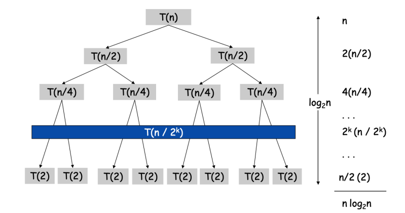

## 목차

1. [Divide and conquer](#divide-and-conquer)
2. [Proof](#proof)
3. [Master theorem](#master-theorem)
4. [References](#references)

---

## Divide and conquer
알고리즘 디자인 패러다임 중 하나이다. 디자인 패러다임은 다음과 같은 종류들이 있다.
* Incremental approach (Insertion sort)
* Divide and conquer (Merge sort)
* Greedy algorithms
* Dynamic programming

+ Divide
    + 문제를 작은 여러 개의 문제로 나눈다.

+ Conquer
    + 재귀로 작은 문제를 풀어나간다. 문제가 충분히 작을 경우, 직접 푼다.

+ Combine
    + 작은 문제들의 해결 방법으로부터 원래 문제의 해결 방법을 얻는다.

### Recurrence for divide and conquer

## Proof
### Recursion tree
T(n)에 대해서 반복되는 트리 구조를 그리는 것

### Telescoping
망원급수, 부분적 항들의 합이 소거 후에 결과적으로 고정된 값만이 남는 급수를 뜻한다.

    For n > 1,
    T(n) = 2T·(n/2) + n,
    T(n)/n = 2T·(n/2)/n + 1 = T(n/2) / (n/2) + 1 = T(n/4) / (n/4) + 1 + 1 = ... = T(n/n) / (n/n) + 1·log_2 n
    = log_2 n,
    T(n) = n·log_2 n 

### Induction
귀납. 'T(n)이 반복을 만족할 경우, T(n) = nlog2n 이다.'를 보인다.
1. Base case: n = 1
2. Inductive hypothesis: T(n) = n·log2n 이라고 가정한다.
3. Goal: T(2n) = 2n·log22n 임을 보여라.

    Pf) T(2n) = 2·T(2n/2) + 2n = 2·T(n) + 2n = 2n·log_2 n + 2n
    = 2n·(log_2 n + 1) = 2n·(log_2 (2n/2) + 1) = 2n·(log_2 2n - 1 + 1)
    = 2n·log_2 2n

## Master theorem
다음의 식을 통하여 반복을 풀어내는 방법이다. 3가지 케이스를 다루는데, 많은 종류의 반복을 쉽게 풀어낼 수 있다.

    T(n) = a·T(n/b) + f(n), 
    a >= 1 인 부분 문제의 개수, b > 1 인 부분 문제의 크기, f(n)은 dividing과 combining의 런타임이다.

### Case 1
만약 ε > 0인 상수에 대해서 f(n) = O(nlogba-ε)이라면, T(n) = θ(nlogba)다.

### Case 2
만약 f(n) = θ(nlogba)라면, T(n) = θ(nlogba·lg n)이다. 

### Case 3
1. ε > 0인 몇 개의 상수에 대해서 f(n) = Ω(nlogba+ε)이고,
2. c < 1인 몇 개의 상수와 충분히 큰 n에 대해서 f(n)이 a·f(n/b) <= c·f(n)을 만족한다면,
3. T(n) = θ(f(n))이다.

### Case 판단
f(n) = nlogba-ε이라고 가정하자.
f(n) = nlogba-ε = nlogba · n-ε,
f(n) / nlogba = n-ε
좌변을 계산하여 우변의 ε > 0인 ε을 도출한다. 필요에 따라 -ε는 +ε로 바뀔 수 있다. 만약 지수승 차이가 존재하지 않는다면 master method는 적용할 수 없다.
 
## References
> + 2022 봄 알고리즘 수업
> + wiki 망원급수: https://ko.wikipedia.org/wiki/%EB%A7%9D%EC%9B%90%EA%B8%89%EC%88%98