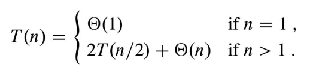

## 목차

1. [Maximum subarray](#maximum-subarray)
2. [Pseudocode](#pseudocode)
3. [Finding max crossing subarray](#finding-max-crossing-subarray)
4. [Analysis of find max crossing subarray](#analysis-of-find-max-crossing-subarray)
5. [References](#references)

---

## Maximum subarray
* Input: 배열 A[1 ... n]. 각 원소는 음수일 수 있다.
* Output: 연속적인 A[i ... j]이 가장 큰 합을 가지는 인덱스 i, j와 max sum을 얻는다.

Naive approach: θ(n2) \
Divide-and-conquer: θ(nlog n)

+ Subproblem: A[low ... high]에서 최대 합을 찾는다. 원래 문제에서는 low = 1, high = n 이다.
+ Divide
    + 배열을 2개의 부분 배열로 나눈다.
    + mid 값을 구해 left = A[low ... mid], right = A[mid+1 ... high]로 나눈다.
+ Conquer
    + left와 right에서 maximum subarray를 찾는다.
+ Combine
    + Midpoint를 관통하며 생기는 maximum subarray를 찾는다.
    + left, midpoint, right 3개의 해결책 중 가장 좋은 해결책을 사용한다.

## Pseudocode

 Pseudocode 

### Find maximum subarray

    FIND-MAXIMUM-SUBARRAY(A, low, high)
    if hight == low
        return (low, high, A[low])
    else mid = ⌊(low + high) / 2⌋
        (left-low, left-high, left-sum) = FIND-MAXIMUM-SUBARRAY(A, low, mid)
        (right-low, right-high, right-sum) = FIND-MAXIMUM-SUBARRAY(A, mid+1, hight)
        (cross-low, cross-high, cross-sum) = FIND-MAX-CROSSING-SUBARRAY(A, low, mid, high)
        if left-sum >= right-sum and left-sum >= cross-sum
            return (left-low, left-high, left-sum)
        else if right-sum >= left-sum and right-sum >= cross-sum
            return (right-low, right-high, right-sum)
        else return (cross-low, cross-high, cross-sum)

### Find max crossing subarray

    FIND-MAX-CROSSING-SUBARRAY(A, low, mid, high)
    // Find a maximum subarray of the form A[i ... mid]
    left-sum = -∞
    sum = 0
    for i = mid downto low
        sum = sum + A[i]
        if sum > left-sum
            left-sum = sum
            max-left = i
    
    // Find a maximum subarray of the form A[mid+1 ... j]
    right-sum = -∞
    sum = 0
    for j = mid+1 to high
        sum = sum + A[j]
        if sum > right-sum
            right-sum = sum
            max-right = j
    // Return the indices and the sum of the two subarrays.
    return (max-left, max-right, left-sum + right_sum)

## Finding max crossing subarray
중간점을 지나가는 A[mid]는 A[i ... mid]와 A[mid+1 ... j]으로 나뉠 수 있다. (low <= i <= mid, mid < j <= high) 좌우로 배열 A를 넓혀가면서 최대합을 찾는다.

### Run time of Finding max crossing subarray
시간복잡도는 θ(n)이다.
* low부터 high 까지 범위에 있는 인덱스들을 한 번만 고려하므로 n 개이다.
* 각 반복은 θ(1)이다.

## Analysis of find max crossing subarray
* T(n)은 FIND-MAXIMUM-SUBARRAY의 런타임이다.
* Base case: low = high 일 때, n = 1이므로 T(n) = θ(1)이다.
* Recursive case: n > 1이다.
    * Divide는 θ(1)이다.
    * Conquer를 진행할 때, n/2 개의 원소를 가지는 부분 배열을 만든다. 각 부분 배열을 conquer하는 데 T(n/2) 시간이 걸리므로 2T(n/2) 시간이 걸린다.
    * Combine은 FIND-MAX-CROSSING-SUBARRAY 함수를 실행한다. 이 함수는 θ(n) 시간이 걸린다. 그리고 3개의 최대값 중 하나를 고르는 것은 θ(1)이므로 θ(n)+θ(1) 이다.

따라서 T(n) = θ(1) + 2T(n/2) + θ(n) + θ(1) = 2T(n/2) + θ(n) 이다. (θ(1)는 θ(n)에 의해 무시된다.)

결론적으로 시간복잡도는 θ(nlog n)이다.

## References
> + 2022 봄 알고리즘 수업