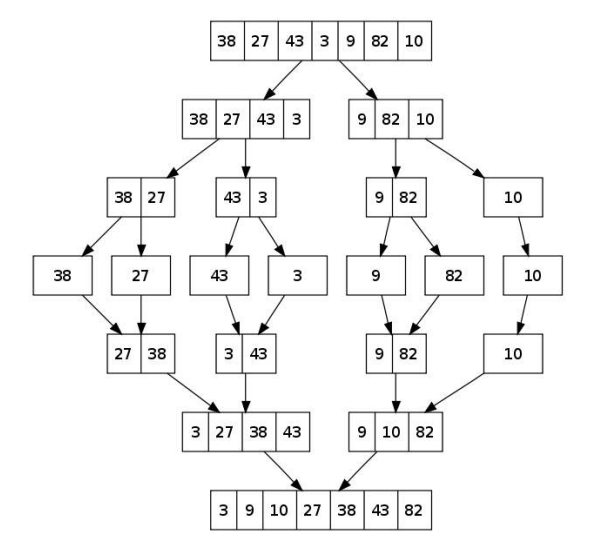
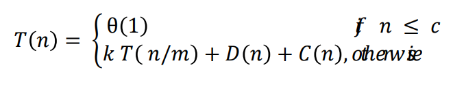
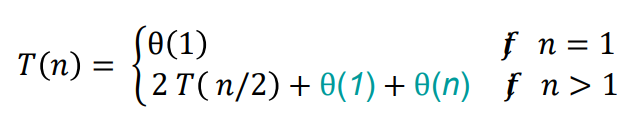
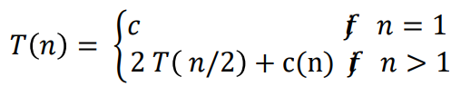
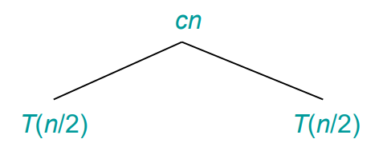
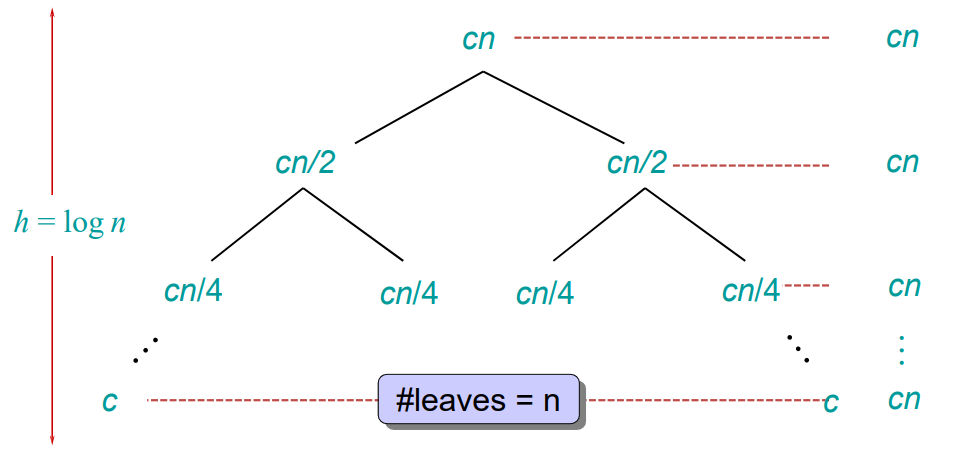

# 목표
> + Merge sort algorithm을 이해한다.
> + Merge sort algorithm을 구현할 수 있다.
> + Merge sort algorithm을 라인 별로 수행시간을 분석할 수 있다.
> + Merge sort algorithm의 best, worst case를 분석할 수 있다.
> + Merge sort algorithm의 runtime을 계산할 수 있다.
> + Merge sort algorithm의 시간복잡도를 계산할 수 있다.

---

## 목차

1. [Merge sort algorithm](#merge-sort-algorithm)
2. [Pseudocode](#pseudocode)
3. [Merge](#merge)
4. [Analysis of divide and conquer in merge sort](#analysis-of-divide-and-conquer-in-merge-sort)
5. [Time complexity](#time-complexity)
6. [장단점](#장단점)
7. [Reference](#references)

---

## Merge sort algorithm
+ 재귀와 분할-정복(divide and conquer) 기반한 정렬 방법이다. 재귀함수로 구성되어있다.



+ Divide
    1. 문제를 작은 여러 개의 문제로 나눈다.
    2. N 개의 원소를 가진 수열(sequence)가 있을 경우, N/2 개의 원소를 가진 부분수열(subsequences)로 나눈다. 
+ Conquer
    1. 재귀로 작은 문제를 풀어나간다. 문제가 충분히 작을 경우, 직접 푼다.
    2. Merge sort 함수를 재귀함수로 불러 Subsequences를 정렬한다.
    3. Subsequences의 길이가 충분히 작을 경우(보통은 길이가 1), 직접적으로 푼다. (길이가 1인 배열은 이미 정렬되어있다고 본다.) 
+ Combine
    1. 작은 문제들의 해결 방법으로부터 원래 문제의 해결 방법을 얻는다.
    2. 2개의 subsequences를 합병하여 정렬된 sequence를 얻는다.

## Pseudocode
### Merge sort pseudocode

    MERGE-SORT(A[1 ... n], p, r)
        If p < r,
            q <- ⌊p + r / 2⌋        # ⌊x⌋ = floor(x)
            MERGE-SORT(A, p, q)
            MERGE-SORT(A, q+1, r)
            MERGE(A, p, q, r)


p, q, r은 p <= q <= r인 배열 요소의 index이다. P는 제일 작은 index이고, r은 제일 높은 index이다. 

### Merge pseudocode

    n<sub>1</sub> <- (q - p) + 1
    n<sub>2</sub> <- (r - q)
    create arrays L[1 ... n<sub>1</sub> + 1] and R[1 ... n<sub>2</sub> + 1]
    for i <- 1 to n<sub>1</sub> do
        L[i] <- A[(p + i) - 1]
    for j <- 1 to n<sub>2</sub> do
        R[j] <- A[q + j]
    L[n<sub>1</sub> + 1] <- ∞
    R[n<sub>2</sub> + 1] <- ∞
    i <- 1
    j <- 1
    # 12-17 lines
    for k <- p to r do
        if L[i] <= R[j]
            then A[k] <- L[i]
                i <- i + 1
            else A[k] <- R[j]
                j <- j + 1

## Merge
합병은 다음과 같이 가정한다.
1. 이미 정렬된 2개의 부분 배열과 빈 배열이 있다고 가정한다. 
2. 부분 배열의 마지막에는 sentinel(배열의 마지막임을 알리는 수)가 있다고 가정한다.
3. 두 개의 부분 배열을 각각 p부터 q(첫번째 부분 배열), q+1 부터 r(두번째 부분 배열)으로 indexing한다.
4. 두 개의 부분 배열을 합하면 (r-p) + 1 개의 원소가 있기에, 이 사이즈의 빈 배열(output array)이 필요하다.
5. 각각의 부분 배열의 원소에서 각자 가장 작은 것(제일 작은 index)을 선택한다.
6. 두 개의 원소를 비교하여, 값이 더 작은 것을 output array에 담는다.
7. 5번, 6번을 (r-p) + 1 번 반복한다. 

합병은 두 개의 부분 배열이 이미 정렬되어 있고, 각 단계에서 그것을 유지한다. 따라서 output array도 정렬되어 있다.

<details><summary> Analysis of MERGE </summary>

### Analysis of MERGE
* 12-17 라인의 반복은 Merge 함수가 동작하는 방법의 핵심이다. Loop invariant를 포함하고 있기 때문이다. 
* 부분배열 A[p ... k-1]는 L[1 ... n<sub>1</sub>+1]과 L[1 ... n<sub>2</sub>+1]의 (k-p) 번째의 가장 작은 요소들을 정렬된 순서로 가지고 있다.
* L[i]와 R[j]는 A로 복사되지 않은 가장 작은 원소이다.

### 1. Initialization
```
    i <- 1
    j <- 1
    # 12-17 lines
    for k <- p to r do
        if L[i] <= R[j]
            then A[k] <- L[i]
                i <- i + 1
            else A[k] <- R[j]
                j <- j + 1
```

12-17 라인의 for loop가 첫 반복을 시작하기 전의 loop invariant를 검증한다.
* For loop를 만나면 k는 p로 할당된다.
* 부분 배열 A[p ... k-1]이 빈 배열이라는 것을 의미한다.
* k-p = 0 이므로 부분배열은 L과 R의 (k-p = 0) 번째의 가장 작은 원소를 포함한다는 것을 보장한다.
* 10, 11 라인에서 i = j = 1 이므로 L[i]와 R[j]는 A에 복사되지 않은 가장 작은 원소이다.

### 2. Maintence
각 반복이 invariant를 유지하는지를 판단한다.
* 반복을 진행하면서 A[p ... k-1]은 L과 R의 (k-p) 번째의 가장 작은 원소를 포함하고 있다는 것을 알 수 있다.
* if L[i] <= R[j] 일 경우
    * L[i]는 A에 복사되지 않은 가장 작은 원소이다.
    * 14 라인에서 L[i]는 A[k]에 복사된다.
    * 이 시점에서 A[p ... k]는 (k-p+1) 번째의 가장 작은 원소를 가지고 있다.
    * 12라인에서 k, 15라인에서 i를 증가시킨다.
    * 다음 반복을 진행한다.
* if L[i] >= R[j] 일 경우, 16-17라인이 loop invariant를 유지시킨다.

### 3. Termination
반복이 종료된 후, invariant가 merge sort의 correctness를 보일만한 속성을 제공하는지를 확인한다.
* Loop invariant는 "부분배열 A[p ... k-1]는 L[1 ... n<sub>1</sub>+1]과 L[1 ... n<sub>2</sub>+1]의 (k-p) 번째의 가장 작은 요소들을 정렬된 순서로 가지고 있다." 이다.
* 반복문을 벗어나면 k = r+1 이다. 따라서 r = k - 1이고, A[p ... k-1]은 A[p ... r]이며 꽉 찬 배열이다.
* L과 R 배열은 n<sub>1</sub> + n<sub>2</sub> + 2 개의 원소(+2는 sentinel)를 가진다.
* 1, 2 라인으로부터 n<sub>1</sub> + n<sub>2</sub> = ((q-p) + 1) + (r-q) = (r-p) + 1 임을 알 수 있다. 이는 A의 원소 개수이다.
```
    n<sub>1</sub> <- (q - p) + 1
    n<sub>2</sub> <- (r - q)
```

</details>

## Analysis of divide and conquer in merge sort
### Setting
* T(n)을 n 사이즈의 문제를 해결하는 실행 시간이라고 가정한다.
* 문제가 충분히 작다면(n <= c), 바로 풀기 때문에 상수 시간이 걸리므로 θ(1)이다.
* 문제가 크다면, 그것을 1/m 개의 사이즈를 가지는 k 개의 부분 문제로 나눈다. Merge sort는 m과 k가 2이다.
* D(n)은 문제를 부분 문제로 나누는 데 걸리는 시간이다.
* C(n)은 부분 문제의 해결 방법을 원래 문제의 해결 방법으로 합치는데 걸리는 시간이다.



### Base case
n = 1일 때
* Merge sort 배열의 사이즈가 1이므로 θ(1)
* Divide: 배열의 중간값을 계산하므로 D(n) = θ(1)
* Conquer: Merge sort 함수를 2번 실행하므로, 각 함수는 1/2 크기의 부분 배열을 다룬다. 따라서 2T(n/2)이다.
* Combine: n 개의 부분 배열을 합병하므로 C(n) = θ(n)이다.




n = 2의 거듭제곱일 때
* Dividie: log<sub>2</sub>n 번 반복
* T(n) = 2T(n/2) + cn (c > 0)은 다음 과정을 거친다.




## Time complexity
* Merge sort를 log<sub>2</sub>n + 1 번 호출한다.
* 전체 비용은 cn(log<sub>2</sub>n + 1)이다.
* 따라서 θ(nlog<sub>2</sub>n)이다.

## 장단점
* 단점
    * 만약 레코드를 배열로 구성하면 임시 배열이 필요하기에 제자리 정렬이 아니다.
    * 레코드들의 크기가 큰 경우에는 이동 횟수가 많아 매우 큰 시간적 낭비를 초래한다.
* 장점
    * 데이터 분포에 영향을 덜 받는다. 입력 데이터가 무엇이든 간에 정렬되는 시간은 동일하기에, 안정적인 정렬 방법이다.
    * 만약 레코드를 연결 리스트로 구성하면, 링크 인덱스만 변경 되므로 데이터의 이동은 무시할 수 있을 정도로 작아진다. 따라서 제자리 정렬로 구현할 수 있다.
    * 크기가 큰 레코드를 정렬할 경우에 연결 리스트를 사용하면, 합병 정렬은 퀵 정렬을 포함한 다른 어떤 정렬보다 효율적이다.

제자리 정렬: 주어진 메모리 공간 외에 추가적인 메모리를 필요로 하지 않는 정렬

## References
> + 합병 정렬(merge sort)이란: https://gmlwjd9405.github.io/2018/05/08/algorithm-merge-sort.html
> + 2022 봄 알고리즘 수업