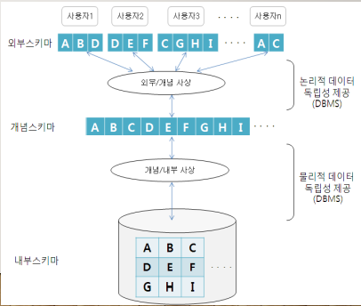

## 목차

1. [데이터와 정보](#데이터와-정보)
2. [정보 시스템](#정보-시스템)
3. [데이터베이스](#데이터베이스)
4. [데이터베이스의 3단계 구조](#데이터베이스의-3단계-구조)
4. [References](#references)

## 데이터와 정보
+ 데이터 
    + 현실에서 관찰 또는 수집의 결과로 나타난 객관적 사실
    + 획득된 그대로의 정량적 혹은 정성적 실제 값
    + Fact & value

+ 정보
    + 획득된 데이터에 의미를 부여하거나 가공 처리를 통해, 의사 결정에 활용하도록 체계적으로 조직한 결과물
    + 그래프, 차트 등

### 데이터의 분류
+ 정형 데이터
    + 미리 정해진 구조에 따라 저장된 데이터이다.
+ 반정형 데이터
    + 구조에 따라 저장된 데이터지만, 데이터 내용 안에 구조에 대한 설명이 함께 존재한다.
    + 구조를 파악하는 파싱(parsing) 과정이 필요하다.
    + HTML, XML, JSON 등
+ 비정형 데이터
    + 정해진 구조가 없이 저장된 데이터이다.
    + SNS 데이터, 워드, PDF 등

## 정보 시스템
한 조직의 활동과 운영에 필요한 데이터를 수집, 저장해 두었다가 다양한 방식으로 처리 및 가공함으로써 의사 결정에 필요한 정보를 생성하는 소프트웨어 체계이다. \ 
수집된 데이터를 저장했다가 필요할 때 제공하는 역할은 정보 시스템의 핵심 요소인 데이터베이스가 담당

## 데이터베이스
특정 조직의 여러 사용자가 공유하여 사용할 수 있도록 통합해서 저장한 운영 데이터의 집합이다. 데이터베이스 접근은 DBMS가 한다. 응용 프로그램이나 사용자는 DBMS를 통해서만 데이터 처리가 가능하다.

+ 통합 데이터
    + 데이터 중복성 문제를 해결한다.
+ 저장 데이터
+ 공유 데이터
    + 공통 데이터 모델과 표준 데이터 언어를 통해, 데이터 종속성 문제를 해결한다.
+ 운영 데이터
    + 조직을 운영하고 조직의 주요 기능을 수행하기 위해 꼭 필요한 데이터의 집합이다.

### 특징
+ 실시간 접근(Realtime accessibility)
    + 데이터 요구에 실시간으로 응답한다.
+ 동적 변화(Continuous evolution)
    + 현실 세계의 상태를 정확히 반영하기 위해서, 지속적으로 데이터를 관리하여 정확한 상태를 유지한다.
+ 동시 공유(Concurrent sharing)
    + 서로 다른 데이터 뿐만 아니라 같은 데이터의 동시 사용도 지원한다.
+ 내용 기반 참조(Content referencing)
    + 데이터가 저장된 주소나 위치가 아닌 내용으로 참조한다.

## 데이터베이스의 3단계 구조
데이터베이스를 쉽개 이해하고 이용할 수 있도록, 하나의 데이터베이스를 관점에 따라 세 단계로 나눈 것이다. 이를 통해 데이터 독립성을 실현한다. 외부, 개념, 내부 3단계와 대응 관계로 이루어져 있다. 내부에서 외부 단계로 갈수록 추상화 레벨이 높아진다.

3단계와 대응 관계

### 스키마와 인스턴스
+ 스키마 - 데이터베이스에 저장되는 데이터 구조와 제약조건을 정의한다.
+ 인스턴스 - 스키마에 따라 데이터베이스에 실제로 저장된 값이다.

### 외부 단계
데이터베이스를 개별 사용자 관점에서 이해하고 표현하는 단계이다. 데이터베이스 하나에 스키마가 여러 개 존재할 수 있다.
+ 외부 스키마(서브 스키마)
    + 외부 단계에서 사용자에게 필요한 데이터베이스를 정의한 것이다.
    + 각 사용자가 생각하는 데이터베이스의 모습이므로 사용자마다 다르다.

### 개념 단계
데이터베이스를 조직 전체의 관점에서 이해하고 표현하는 단계이다. 데이터베이스 하나에 개념 스키마 하나만 존재한다.
+ 개념 스키마
    + 개념 단계에서 데이터베이스 전체의 논리적 구조를 정의한 것이다.
    + 조직 전체의 관점에서 생각하는 데이터베이스의 모습이다.
    + 데이터와 관계, 제약조건, 보안정책, 접근 권한에 대한 정의를 포함한다.

### 내부 단계
데이터베이스를 저장 장치의 관점에서 이해하고 표현하는 단계이다. 데이터베이스 하나에 내부 스키마 하나만 존재한다.
+ 내부 스키마
    + 전체 데이터베이스가 저장 장치에 실제로 저장되는 방법을 정의한다.
    + 레코드에 관한 물리적 저장 구조를 정의한다.

### 논리적 데이터 독립성(외부/개념 사상)
외부 스키마와 개념 스키마의 대응 관계를 정의한다. 응용 인터페이스(Application interface)라고도 한다. 개념 스키마가 변경되어도 외부 스키마는 영향받지 않고, 관련된 외부/개념 사상만 정확하게 수정해주면 된다.

### 물리적 데이터 독립성(개념/내부 사상)
개념 스키마와 내부 스키마의 대응 관계를 정의한다. 저장 인터페이스(storage interface)라고도 한다. 내부 스키마가 변경되어도 개념 스키마는 영향받지 않고, 관련된 개념/내부 사상만 정확하게 수정해주면 된다.

## References
* 2022 봄 소프트웨어공학 강의