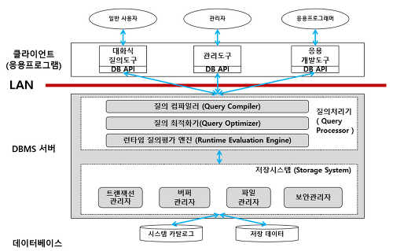

## 목차

1. [데이터베이스 시스템](#데이터베이스)
2. [시스템 데이터베이스](#시스템-데이터베이스)
3. [데이터베이스 사용자](#데이터베이스-사용자)
4. [데이터 언어](#데이터-언어)
5. [데이터베이스 서버](#데이터베이스-서버)
6. [References](#references)

## 데이터베이스 시스템
DBS, DataBase System이라고 한다. 데이터베이스에 데이터를 저장하고, 이를 관리하여 조직에 필요한 정보를 생성해주는 시스템이다.

## 시스템 데이터베이스
데이터베이스 시스템이 사용하는 데이터가 저장되어 있는 데이터베이스이다. 

### 데이터 사전
시스템 카탈로그(system catalog)라고도 한다. 데이터베이스에 저장되는 데이터에 관한 정보, 즉 메타 데이터를 유지하는 시스템 데이터베이스이다. 메타 데이터는 데이터에 대한 데이터를 뜻한다.
+ 스키마, 사상 정보, 다양한 제약조건 등을 저장한다.
+ 데이터베이스 관리 시스템이 스스로 생성하고 유지한다.
+ 일반 사용자도 접근이 가능하지만 저장 내용을 검색만 할 수 있음

### 데이터 디렉터리
데이터 사전에 있는 데이터에 실제로 접근하는 데 필요한 위치 정보를 저장하는 시스템 데이터베이스이다. 일반 사용자의 접근은 허용되지 않는다.

## 데이터베이스 사용자
데이터베이스를 이용하기 위해 접근하는 모든 사람을 뜻한다. 이용 목적에 따라 최종 사용자, 응용 프로그래머, 데이터베이스 관리자로 구분한다.

+ 최종 사용자
    + 데이터베이스에 접근하여 데이터를 조작(삽입, 삭제, 수정, 검색)하는 사람을 뜻한다. 
    + 따라서 주로 데이터 조작어를 사용한다.

+ 응용 프로그래머
    + 데이터 언어를 삽입하여 응용 프로그램을 작성하는 사람을 뜻한다.
    + 따라서 주로 데이터 조작어를 사용한다.

+ 데이터베이스 관리자(DBA; DataBase Administrator)
    + 데이터베이스 시스템을 운영 및 관리하는 사람이다.
    + 주로 데이터 정의어와 데이터 제어어를 사용한다.

## 데이터 언어
사용자와 데이터베이스 관리 시스템 간의 통신 수단이다. 사용 목적에 따라 데이터 정의어, 데이터 조작어, 데이터 제어어로 구분한다.

+ 데이터 정의어(DDL; Data Definition Language)
    + 새로운 데이터베이스 구조를 정의하고, 기존 데이터베이스 구조를 변경하는 명령어이다.
    + 데이터베이스 구조를 표현하는 데이터베이스 스키마를 정의하거나, 수정 또는 삭제하기 위해 사용한다.
    + CREATE, ALTER, DROP 등이 있다. 
    
+ 데이터 조작어(DML; Data Manipulation Language)
    + 데이터베이스 안의 데이터를 실제 조작하는 명령어 집합이다.
    + DBMS에게 데이터의 삽입, 삭제, 수정, 검색 등의 처리를 요구하기 위해 사용한다.
    + INSERT, UPDATE, DELETE, SELECT 등이 있다. 
    + 절차적 데이터 조작어 - 사용자가 어떤 데이터를 원하고, 그 데이터를 얻기 위해 어떻게 처리해야 하는지도 설명한다. (What & How)
    + 비절차적 데이터 조작어 - 사용자가 어떤 데이터를 원하는지만 설명한다. (What)

+ 데이터 제어어(DCL; Data Control Language)
    + 데이터베이스를 제어하고 통제하기 위해 사용하는 명령어 집합이다.
    + 내부적으로 필요한 규칙이나 기법을 정의하기 위해 사용한다.
    + 무결성, 보안, 회복, 동시성 제어 등을 정의하기 위해 사용한다.
    + GRANT, REVOKE, CREATE USER 등이 있다.

## 데이터베이스 서버
데이터베이스가 구동되는 서버의 역할을 하는 컴퓨터이다. 데이터베이스가 물리적으로 저장되며, DBMS가 설치되어 다양한 요청이 처리된다. 이 처리는 시스템 부하가 매우 크기 때문에 보통 데이터베이스 시스템은 독립된 컴퓨터 안에 서버 형태로 운영한다. 클라이언트/서버 컴퓨팅 환경으로, 사용자는 클라이언트 컴퓨터를 통해 접근한다. 

## References
* 2022 봄 데이터베이스 강의