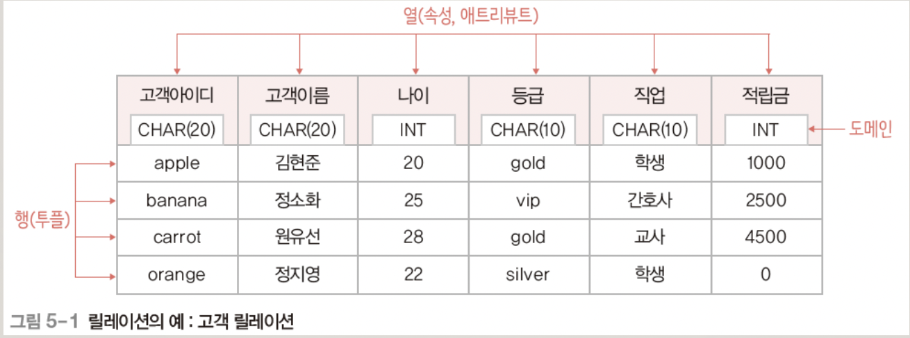

## 목차

1. [데이터 모델](#데이터-모델)
2. [관계 데이터 모델](#관계-데이터-모델)
3. [DBMS의 발전](#dbms의-발전)
4. [References](#references)

## 데이터 모델
Data model, 현실 세계의 데이터를 명세하는 고유한 표현 방식이자 데이터 모델링을 위한 도구이다. 데이터 구조와 연산, 제약 조건 3가지 요소로 구성된다. 

### 데이터 구조
Data structure, 데이터를 어떤 형태로 저장하는지를 표현하는 추상적 표현이다. 실제 저장 구조가 아닌 개념상의 저장 구조를 직관적으로 표현한다.

### 연산
Operation, 개념적인 데이터 구조 안의 데이터를 어떤 방식으로 처리하는지를 표현한다.

### 제약 조건
Constraint, 데이터 구조 안에 데이터를 저장할 때의 구조적 제약사항과 연산을 적용할 때의 행위적 제약 사항을 표현한다.

## 관계 데이터 모델
RDBMS에서는 관계 데이터 모델을 사용한다. 하나의 개체에 대한 데이터를 하나의 릴레이션(relation)에 저장한다. 표 대신 릴레이션이라는 용어를 쓰는 이유는 단순 테이블처럼 보이지만, 테이블 이상의 많은 의미와 제약 사항이 숨겨져 있기 때문이다.

+ 데이터 구조: 릴레이션
+ 연산: 관계 대수
+ 제약 조건: 무결성 제약 조건

 용어 

### 속성
릴레이션의 열에 해당한다. 데이터를 표현하는 가장 논리적 단위로, 의미적으로 더 이상 분해할 수 없는 atomic value만 사용한다.

### 투플
릴레이션의 행에 해당한다. 현실 세계의 객체(entity)를 표현하며, 각 속성의 값들의 조합으로 구성되어 있다.

### 도메인
각 속성이 취할 수 있는 모든 값들의 집합을 정의한 것이다. 속성 값을 입력 및 수정할 때 적합성 판단의 기준이 된다. 일반적으로 속성의 특성을 고려한 데이터 타입으로 정의한다.

### 카디널리티 & 차수
카디널리티는 하나의 릴레이션 안의 전체 투플의 개수이다. 입력, 수정, 삭제 등을 통해 계속 변화하므로 동적 특성을 가진다. \
차수는 하나의 릴레이션을 구성하는 전체 속성의 개수이다. 각 투플이 가지는 속성 값의 개수는 릴레이션의 차수와 같다. 정적 특성을 가진다. \
널은 속성 값을 아직 모르거나 해당되는 값이 없음을 표현한다. 0과 다르다.

### 구성
스키마와 인스턴스로 구성되어 있다.
+ 릴레이션 스키마: 릴레이션의 논리적 구조로, 릴레이션의 이름과 릴레이션에 포함된 모든 속성으로 정의한다. 정적 특성을 가진다. 키 속성은 밑줄로 표시한다. 
    + 고객(고객아이디, 고객이름, 나이, 등급, 직업, 적립금)

+ 릴레이션 인스턴스: 어느 한 시점에서 릴레이션에 존재하는 투플들의 집합이다. 동적 특성을 가진다.

+ 데이터베이스 스키마: 데이터베이스의 전체 구조로, 데이터베이스를 구성하는 릴레이션 스키마의 모음이다.

+ 데이터베이스 인스턴스: 특정 시점에서 데이터베이스를 구성하는 모든 릴레이션 인스턴스의 모음이다.

## 릴레이션
릴레이션은 하나의 개체에 관한 데이터를 2차원 테이블의 구조로 저장한 것이다. 릴레이션들이 모여 데이터베이스를 이룬다.\
한편 릴레이션은 속성의 집합이다. 그러므로 저장 순서나 속성 순서는 무의미하다. 그리고 다중 값 속성이나 복합 속성을 허용하지 않는다.

### 특성
+ 투플의 유일성: 하나의 릴레이션에는 동일한 투플이 존재할 수 없다.
+ 투플의 무순서: 하나의 릴레이션에는 투플 사이의 순서는 무의미하다.
+ 속성의 무순서: 하나의 릴레이션에는 속성 사이의 순서는 무의미하다.
+ 속성의 원자성: 속성 값으로 원자 값만 사용할 수 있다.  

## 키
Key, 릴레이션에서 투플들을 유일하게 구별할 수 있는 속성 또는 속성들의 집합이다. 모든 릴레이션은 키를 갖는다. 릴레이션이 단순한 테이블이 아니라는 것을 보여주는 대표적인 개념이다. 

+ 유일성: 하나의 릴레이션에서 모든 투플은 서로 다른 키 값을 가져야한다.
+ 최소성: 꼭 필요한 최소한의 속성들로만 키를 구성한다. 둘 이상의 속성으로 이루어진 복합키가 아니라면 최소성 조건은 항상 충족한다.

### 종류
+ 슈퍼키: Super key, 유일성을 만족하는 속성 또는 속성들의 집합이다.
+ 후보키: Candidate key, 유일성과 최소성을 만족하는 속성 또는 속성들의 집합이다.
+ 기본키: Primary key, 후보키 중에서 기본적으로 사용하기 위해 선택한 키이다. 대표성을 추가로 가진다.
+ 대체키: Alternate key, 기본키로 선택되지 못한 후보키이다.
+ 외래키: Foreign key, 릴레이션의 기본키를 참조하는 속성 또는 속성들의 집합이다. 
    + 참조하는 기본키 속성의 이름은 달라도 되지만, 도메인은 같아야한다. 
    + 하나의 릴레이션에 외래키는 여러 개 존재 할 수 있다. 
    + 같은 릴레이션의 기본키를 참조할 수도 있다. 널 값을 가질 수 있다.

## 무결성 제약조건
데이터의 무결성을 보장하고 일관된 상태로 유지하기 위한 규칙이다. 무결성이란 데이터를 결함이 없는 상태로 정확하고 유효하게 유지하는 것을 의미한다.

+ 개체 무결성 제약조건: 기본키를 구성하는 모든 속성은 널 값을 가질 수 없다. DBMS에게 기본키를 선언함으로써 즉시 적용된다.
+ 참조 무결성 제약조건: 외래키는 참조할 수 없는 값을 가질 수 없다. DBMS에게 외래키를 선언함으로써 즉시 적용된다.
+ 도메인 무결성 제약조건: 투플의 모든 속성 값이 각 속성의 도메인에 속한 값만을 취해야 한다는 제약 사항이다.     
    + SQL의 CREATE TABLE 명령문 작성 시, 키워드 설정을 통해 DBMS에게 지시한다.
+ 유일성 제약 조건: 모든 키 속성이 서로 중복되지 않고 유일해야 한다는 제약 사항이다. 대체키와 밀접한 연관성이 있으며 키 제약 조건이라고도 한다.
    + SQL의 CREATE TABLE 명령문 작성 시, UNIQUE 키워드 설정을 통해 DBMS에게 지시한다. 

## 관계 연산
Relation operation, 관게형 데이터 모델에서 릴레이션을 조작하기 위한 연산이다. 관계 대수와 관계 해석으로 표현한다.

+ 관계 대수: Relation algebra, 사용자가 필요로 하는 데이터를 획득하기 위해서, 절차(연산들의 적용 순서)를 명세하는 표현 방법이다. How에 중점을 둔다.
+ 관계 해석: Relation calculus, 사용자가 필요한 데이터가 무엇인지, 연산들의 최종 결과만을 명세한다. 선언적 표현 방법으로 비절차적 표현방법이다. What에 중점을 둔다.

둘 다 기능이다 표현력은 동등하다. 형식 언어로서 상용 DBMS가 직접 지원하지는 않으므로, 실제 사용할 수 있는 데이터 언어는 아니다. SQL 언어의 작성 방법이나 내부 처리 방식의 이론적 기반을 제공한다.
## References
* 2022 봄 데이터베이스 강의