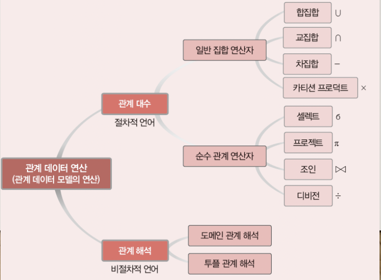

## 목차

1. [데이터 연산](#데이터-연산)
2. [관계 대수](#관계-대수)
3. [관계 대수의 활용](#관계-대수의-활용)
4. [키](#키)
5. [무결성 제약조건](#무결성-제약조건)
6. [관계 연산](#관계-연산)
7. [References](#references)

## 데이터 연산
Data operation, Edgar F. Codd가 정의한 릴레이션을 내부적으로 처리하기 위한 연산들의 집합이다. 원하는 데이터를 얻기 위해 릴레이션에 필요한 처리 요구를 수행하는 것이다. 데이터 언어의 유용성을 검증하는 기준이 되며, 관계 대수나 관계 해석으로 기술할 수 있는 모든 질의를 할 수 있는 데이터 언어를 관계적으로 완전하다고 판단한다.

## 관계 대수
원하는 결과를 얻기 위해서 릴레이션의 처리 과정을 순서대로 기술하는 언어이다. 대표적인 연산자는 8개이다. 피연산자도 릴레이션이고 연산의 결과도 릴레이션인 폐쇄 특성(closure propery)이 존재한다.

+ 기본 연산: Primitive operation이라 한다. ∪(합집합), −(차집합), ×(카티션 프로덕트), σ(셀렉트), Π(프로젝트)는 필수 연산으로 다른 연산으로 대체될 수 없다.
+ 복합 연산: Composite operation이라 한다. ∩(교집합), ⋈(조인), ÷(디비전)는 기본 연산을 이용하여 대체할 수 있다.

 일반 집합 연산자 

## 일반 집합 연산자
Set operation, 릴레이션이 투플의 집합이라는 개념을 이용하는 연산자이다.

### 합집합
Union, R∪S, 릴레이션 R과 S의 합집합을 반환한다.

+ 차수는 변화가 없다.
+ 카디널리티는 릴레이션 R과 S의 카디널리티의 합과 같거나 작다.
+ 교환 및 결합이 가능하다.

### 교집합
Intersection, R∩S, 릴레이션 R과 S의 교집합을 반환한다.

+ 차수는 변화가 없다.
+ 카디널리티는 두 릴레이션의 각 카디널리티보다 크지 않다.
+ 교환 및 결합이 가능하다.

### 차집합
Difference, R-S, 릴레이션 R과 S의 차집합을 반환한다.

+ 차수는 변화가 없다.
+ 카디널리티는 기준이 되는 릴레이션의 카디널리티와 같거나 작다.
+ 교환 및 결합이 불가능하다.

### 카디션 프로덕트
Cartesian product, R☓S, 릴레이션 R의 각 투플과 S의 각 투플을 모두 연결하여 만들어진 새로운 투플을 반환한다.

+ 차수는 두 릴레이션의 차수를 더한 것과 같다.
+ 카디널리티는 두 릴레이션의 카디널리티를 곱한 것과 같다.
+ 교환 및 결합이 가능하다.

합집합, 교집합, 차집합은 피연산자인 두 릴레이션이 합병가능해야한다. 즉 두 릴레이션의 차수가 같으며, 서로 대응되는 속성의 도메인이 같아야 한다.

 순수 관계 연산자 

## 순수 관계 연산자
Relational operation, 릴레이션의 구조와 특성을 이용하는 연산자이다.

### Select
릴레이션에서 조건을 만족하는 투플만 선택하여 결과 릴레이션을 구성한다. 하나의 릴레이션을 대상으로 연산을 수행한다. 결과 릴레이션은 연산 대상 릴레이션의 수평적 부분집합이다.   

+ 수학적으로 표현하면 σ조건식(릴레이션)이다. 
+ 데이터 언어적으로 표현하면 릴레이션 where 조건식이다.
+ 조건식에는 비교 연산자(>, ≥, <, ≤, =, ≠)와 논리 연산자(∧(and), ∨(or), ¬(not))를 이용해 참, 거짓을 판별한다.
+ 교환이 가능하다.

### Project
릴레이션에서 선택한 속성의 값으로 결과 릴레이션을 구성한다. 하나의 릴레이션을 대상으로 연산을 수행한다. 결과 릴레이션은 연산 대상 릴레이션의 수직적 부분집합이다.

+ 수학적으로 표현하면 𝜋속성리스트(릴레이션)이다.
+ 데이터 언어적으로 표현하면  릴레이션[속성리스트]이다.
+ 결과 릴레이션에서 동일한 투플은 중복되지 않고 한 번만 나타난다.

### Join
조인 속성을 이용해 두 릴레이션을 조합하여 결과 릴레이션을 구성한다. 조인 속성은 두 릴레이션이 공통적으로 가지고 있는 속성이다. 조인 속성의 값이 같은 투플만 연결하여 생성된 투플을 결과 릴레이션에 포함한다. 

+ 릴레이션1 ⋈ 릴레이션2 
+ R1⋈조인_조건식R2

### Natural join
동등 조인 결과 중, '조인_조건식'에 사용된 중복 속성을 자동 제거한 조인이다. 동등 조인의 결과 릴레이션에서 중복 속성이 두 번 나오지 않도록 이를 제거한 결과를 반환한다.
+ R1⋈
N(조인_속성_리스트)R2  = R1⋈N(a1,a2)R2

+ a1은 R1의 조인 속성이다.
+ a2는 R2의 조인 속성이다.

### Theta join
𝜽-join, 자연 조인에 비해 더 일반화된 조인이다. 주어진 조인 조건들을 만족하는 두 릴레이션의 모든 투플을 연결하여 생성된 새로운 투플로 결과 릴레이션을 구성한다. 따라서 결과 릴레이션의 차수는 두 릴레이션의 차수를 더한 것과 같다.

+ R1 ⋈a1 𝜃 a2 R2
+ 𝜽는 비교 연산자(>, ≥, <, ≤, =, ≠)를 의미한다.
+ 𝜽가 =이면 동일 조인(equi-join)이라고 한다.
+ Natural join ⊂ Equi-join ⊂ Theta join 

### Division
R2의 모든 투플과 관련이 있는 R1의 투플로 결과 릴레이션을 구성한다. 단, 도메인이 같아야 한다.
+ R1 ÷ R2

 확장된 관계 대수 연산자 

## 확장된 관계 대수 연산자
### Semi-join
조인 속성으로 프로젝트 연산을 수행한 릴레이션을 이용하는 조인이다. R2를 조인 속성으로 프로젝트 연산한 후, R1에 자연 조인하여 결과 릴레이션을 구성한다. 불필요한 속성을 미리 제거하여 조인 연산 비용을 줄일 수 있다.

+ R1 ⋉(a1,a2)R2(왼쪽 세미 조인), R1 ⋊(a1,a2) R2(오른쪽 세미 조인)
+ 교환 X

### Outer-join
자연 조인 연산에서 제외되는 투플도 널 값으로 채워서 결과 릴레이션에 포함시키는 조인이다. 두 릴레이션에 있는 모든 투플을 결과 릴레이션에 포함시킨다. 

+ R1⋈+(a1,a2)R2, ⟗ (완전 외부 조인)
+ R1⋉+(a1,a2)R2, ⟕ (왼쪽 외부 조인)
+ R1+(a1,a2)R2, ⟖ (오른쪽 외부 조인)

### Outer union
부분적으로만 합병 가능한 두 릴레이션의 투플을 합병한다. 대응하는 속성이 없는 경우도 널 값을 채워 모든 투플을 결과 릴레이션에 포함한다.

## 관계 대수의 활용
DBMS는 SQL 질의문을 처리하기 위해서 내부적으로 관계 대수식을 스스로 작성하고, 연산자를 순서대로 적용하여 질의 결과를 생성한다. 데이터베이스 사용자가 요청한 SQL 문장은 이렇게 DBMS 내부에서 해석되어 처리된다. 왜냐하면 SQL 문장은 절차가 명세되어 있지 않기 때문에 DBMS는 그 처리 순서와 방법을 결정해야 하기 때문이다. \
같은 질의 요청에 대해서 여러 관계 대수식 표현이 가능하다. 이러한 관계 대수식들은 상대적으로 보다 효율적인, 비효율적인 관계 대수식들이 존재한다. 따라서 최적의 관계 대수식을 작성하는 것은 DBMS의 핵심 역할이다. 

### 질의 트리
관계 대수 연산 순서에 관한 트리이다. 생성된 후보 관계 대수식은 DBMS 안의 질의 최적화 과정을 통해 질의트리로 변한된다. 여러 가능한 후보 질의 트리들을 최적에 가까운 트리로 변환해 가며 하나의 질의 실행 계획(Query execution plan)을 결정한다. 연산 순서를 조정함으로써 연산으로 생기는 중간 릴레이션의 크기를 최소화하여 질의를 최적화한다.

### 질의 트리 최적화 변환 규칙
보다 최적화된 질의 트리로 변환하기 위해 적용하는 기본 규칙이다.
+ AND 연산자로 연결된 셀렉트 연산은 분리하여 개별 셀렉트 연산으로 변환
+ 셀렉트 연산은 가능한 한 먼저 실행되도록 질의 트리 아래쪽으로 이동
+ 프로젝트 연산도 프로젝트 속성을 분리해서 개별 프로젝트 연산으로 변환한 뒤, 가능한 한 먼저 실행되도록 질
의 트리 아래쪽으로 이동
+ 여러 셀렉트 연산중에서는 결과 릴레이션 크기가 가장 작은 것부터 제한적 셀렉트 연산 순으로 질의 트리 최하
단으로 이동
+ 카티션 프로덕트 연산과 바로 위의 셀렉트 연산은 하나의 조인 연산으로 통합 변환
+ OR 연산자로 연결된 조건식은 가능하면 AND 연산자로 연결된 조건식으로 변환

## 관계 해석
Relation calculus, 처리를 원하는 데잉터가 무엇인지만 기술하는 언어이다. 

### 술어 해석식
+ 속성과 상수의 집합
+ 비교 연산자의 집합
    + 예) <, ≤, ≥, ＝, ≠
+ 연결자의 집합 
    + 예) and(∧), or(∨), not(¬)
+ 내포(⇒) : x ⇒ y , x가 참이면 y도 참이다. 
    + x ⇒ y ≡ ¬ x ∨ y
+ 한정자의 집합
    + ∃ t ∈ r (Q(t)) ≡ 술어 Q(t)가 참인 릴레이션 r내에 튜플 t가 존재한다.
    + ∀ t ∈ r (Q(t)) ≡ 릴레이션 r내의 모든 튜플 t에 대해 Q가 참이다.

### 투플 관계 해석
{ t | P(t) } 형식의 비절차식 질의어이다. 
+ 술어 P가 t에 대해 참인 모든 튜플 t의 집합을 뜻한다.
+ t는 튜플 변수이고, t[A]는 속성 A에 대한 튜플 t의 값을 의미한다.
+ t ∈ r 는 튜플 t가 릴레이션 r에 속함을 의미한다.
+ P는 술어 해석과 유사한 식

### 도메인 관계 해석
튜플 관계형 해석과 능력이 동등한 비절차식 질의어이다. 
+ {<x1, x2, …, x n> | P(x1, x2, …, x n)}

## References
* 2022 봄 데이터베이스 강의