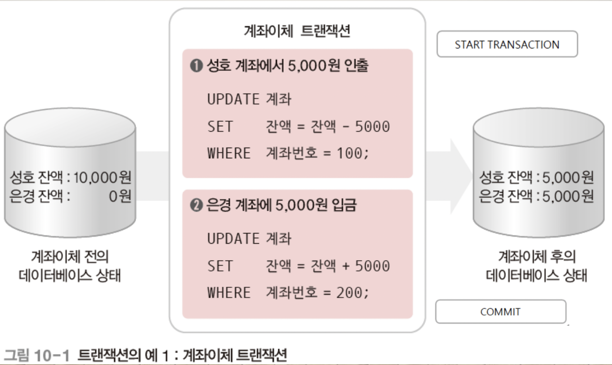
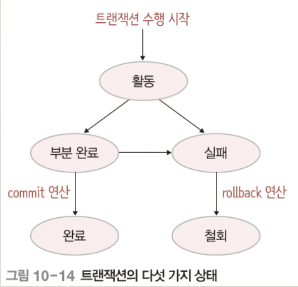

## 목차

1. [트랜잭션](#트랜잭션)
2. [정보 시스템](#정보-시스템)
3. [데이터베이스](#데이터베이스)
4. [데이터베이스의 3단계 구조](#데이터베이스의-3단계-구조)
4. [References](#references)

## 트랜잭션
하나의 작업을 수행하는데 필요한 데이터베이스 연산(SQL 문)들을 모아놓은 것이다. 특히 데이터베이스를 변경하는 INSERT, DELETE, UPDATE 문의 실행을 관리한다. 장애 발생 시, 복구 작업이나 병행 제어 작업을 위한 중요한 단위로 사용된다. 따라서 데이터베이스의 무결성과 일관성을 보장하기 위해, 작업 수행에 필요한 연산들을 하나의 트랜잭션으로 제대로 정의하고 관리해야 한다.

=> 처리 순서는 중요하지 않지만, 두 개의 UPDATE 문이 모두 정상적으로 실행되어야 한다. 혹은 문제가 발생하낟면 두 개의 UPDATE 문이 모두 정상적으로 취소되어야 한다.

## ACID 
트랜잭션이 가져야하는 4가지 특성이다. 데이터베이스의 형태에 따라서 특성의 내용이나 개수는 변경될 수 있다.

### Atomicity
원자성, 트랜잭션의 연산들이 모두 정상적으로 실행되거나 하나도 실행되지
않아야 하는 all-or-nothing 방식을 의미한다. 트랜잭션 수행 도중 장애가 발생한다면, 지금까지의 수행 결과를 모두 취소하고 트랜잭션을 다시 실행하거나 폐기시킨다.

### Consistency
일관성, 트랜잭션이 성공적으로 수행된 후에도 데이터베이스가 일관된 상태를 유지해야 함을 의미한다.

### Isolation
고립성, 트랜잭션이 성공적으로 수행된 후에도 데이터베이스가 일관된 상태를 유지해야 함을 의미한다.

### Durability
지속성, 트랜잭션이 성공적으로 완료된 후 데이터베이스에 반영한 수행 결과는 영구적이어야 함을 의미한다.

## 트랜잭션 지원 DBMS 모듈

### 동시성 제어 모듈
일관성과 고립성을 제어한다. 동시에 실행되는 트랜잭션 간의 간섭을 제어한다. 최종적으로 각 트랜잭션이 순차적으로 실행한 결과와 동일한 고립성 결과를 보장하고 트랜잭션 실행 이전과 이후의 데이터베이스 일관성이 항상 유지되도록 함

### 회복 모듈 
원자성과 지속성을 제어한다. 완전한 트랜잭션 결과의 복구를 보장한다. 장애 발생 시 트랜잭션 실행의 원자성을 보장하고 커밋된 트랜잭션의 결과는 반드시 데이터베이스에 반
영되도록 지속성을 지원한다.

## 트랜잭션 연산
트랜잭션을 실행하는 연산으로는 크게 Commit과 Rollback이 있다.

### Commit
트랜잭션의 수행이 성공적으로 완료되었음을 선언하는 연산이다. Commit 연산이 실행되면 트랜잭션의 수행 결과가 데이터베이스에 반영되고 일관된 상태를 지속
적으로 유지하게 된다.

### Rollback
트랜잭션의 수행이 실패했음을 선언하는 연산이다. Rollback 연산이 실행되면 트랜잭션이 지금까지 실행한 연산의 결과가 취소되고, 데이터베이스가
트랜잭션 수행 전의 일관된 상태로 되돌아간다.

### 상태
+ 활동 상태: Active, 트랜잭션이 수행되기 시작하여 현재 수행 중인 상태이다.
+ 부분 완료 상태: Partially committed, 트랜잭션의 마지막 연산이 실행을 끝낸 직후의 상태이다.
+ 완료 상태(Committed) 
    + 트랜잭션이 성공적으로 완료되어 commit 연산을 실행한 상태이다.
    + 트랜잭션이 수행한 최종 결과를 데이터베이스에 반영하고, 데이터베이스가
새로운 일관된 상태가 되면서 트랜잭션이 종료된다.
+ 실패 상태(Failed)
    + 장애가 발생하여 트랜잭션의 수행이 중단된 상태이다.
+ 철회 상태(Aborted)
    + 트랜잭션의 수행 실패로 rollback 연산을 실행한 상태이다.
    + 지금까지 실행한 트랜잭션의 연산을 모두 취소하고 트랜잭션이 수행되기 전의 데이터베이스 상태로 되돌리면서 트랜잭션이 종료된다.
    + 철회 상태로 종료된 트랜잭션은 상황에 따라 다시 수행되거나 폐기된다.

## 종류 

### 명시적 트랜잭션
트랜잭션의 시작과 끝을 사용자가 직접 명시적으로 지정하는 트랜잭션이다. '사용자 트랜잭션' 또는 '수동 트랜잭션'이다. 

~~~ SQL
START TRANSACTION;
    SQL 명령문;
{ COMMIT | ROLLBACK};
~~~

+ 형식 명시적 트랜잭션을 정의하는 명령문의 형식
+ START TRANSACTION 명령문은 직접 트랜잭션의 시작을 지시
+ COMMIT 명령문은 트랜잭션의 모든 처리 결과의 정상적 처리를 확정하는 명령어로 변경 내용을 모두 실제 데이터베이스에 영구적으로 반영한다.
+ ROLLBACK 명령문은 작업 중 장애나 문제가 발생하여 트랜잭션의 처리 과정에서 발생한 변경 내용을 모두 취소하는 명령어로 트랜잭션 시작 이전의 원래 상태로 되돌린다.

### 자동완료 트랜잭션
SQL문 하나를 독립된 하나의 트랜잭션으로 자동 정의하고 SQL문의 실행 결과에 따라 자동으로 커밋 또는 롤백하는 트랜잭션이다. 
+ 기본 모드의 트랜잭션, ‘시스템 트랜잭션’
+ DBMS가 각 SQL 문장 앞뒤에 START TRANSACTION문과 COMMIT문 또는 ROLLBACK문을 자동으로 붙여 실행한다.

~~~ SQL
SELECT @@AUTOCOMMIT;
SET AUTOCOMMIT = 1;
~~~

### 수동완료 트랜잭션
트랜잭션의 끝만 사용자가 직접 명시적으로 지정하는 트랜잭션으로, 암시적(implicit) 트랜잭션이다. 다음 명령문 실행하면 START TRANSACTION 명령문 없이도 트랜잭션이 자동으로 시작한다.

~~~ SQL
SELECT @@AUTOCOMMIT;
SET AUTOCOMMIT = 0; (수동완료 모드 설정)
~~~

## 장애
시스템이 제대로 동작하지 않는 상태이다.

+ 트랜잭션 장애
    + 트랜잭션 수행 중 오류가 발생하여 정상적으로 수행을 계속할 수 없는 상태이다.
    + 트랜 잭션의 논리적 오류, 잘못된 데이터 입력 등으로 발생한다.
+ 시스템 장애
    + 하드웨어의 결함으로 정상적으로 수행을 계속할 수 없는 상태이다.
    + 하드웨어 이상으로 메인 메모리에 저장된 정보가 손실되거나 교착 상태가 발생한 경우 등으로 발생한다.
+ 미디어 장애
    + 디스크 장치의 결함으로 디스크에 저장된 데이터베이스의 일부 혹은 전체가 손상된 상태이다.
    + 디스크 헤드의 손상이나 고장 등으로 발생한다.

### 저장 장치
+ 휘발성 저장 장치
    + 장애가 발생하면 저장된 데이터가 손실된다.
+ 비휘발성 저장 장치
    + 장애가 발생해도 저장된 데이터가 손실되지 않지만, 미디어 장애가 발생하면 손실된다.
+ 안정 저장 장치
    + 비휘발성 저장 장치를 이용해 데이터 복사본을 여러 개 만드는 방법이다.

## 회복
장애가 발생했을 때, 데이터베이스를 장애가 발생하기 전의 일관된 상태로 복구시키는 행위이다. 장애 발생 시점에 이미 커밋된 트랜잭션의 변경 내용은 로그를 이용하여 반드시 데이터베이스에 반영한다. 반면 커밋되지 못하고 중단된 트랜잭션의 실행 결과는 철회되어야 한다. 

### 덤프
데이터베이스 전체를 다른 저장 장치에 주기적으로 복사하는 방법이다.

### 로그
데이터베이스에서 변경 연산이 실행될 때마다 데이터를 변경하기 이전 값과 변경한 이후의 값을 별도의 파일에 기록하는 방법이다.

### 재실행
전반적으로 데이터베이스가 손상된 경우에 주로 사용한다. 가장 최근에 저장한 데이터베이스 복사본을 가져온 후, 로그를 이용해 복사본이 만든다. 이후 실행된 모든 변경 연산을 재실행하여 장애가 발생하기 직전의 데이터베이스 상태로 복구한다.

### 취소
변경 중이었거나 이미 변경된 내용만 신뢰성을 잃은 경우에 주로 사용한다. 로그를 이용해 지금까지 실행된 모든 변경 연산을 취소하여 데이터베이스를 원래의 상태로 복구한다.

## 회복 기법

### 즉시 갱신 회복 기법(로그)
트랜잭션 수행 중에 데이터 변경 연산의 결과를 데이터베이스에 즉시 반영한다. 
+ 장애 발생에 대비하기 위해 데이터 변경에 대한 내용을 로그 파일에 기록한다.
    + 데이터 변경 연산이 실행되면, 로그 파일에 로그 레코드를 먼저 기록한 다음
데이터베이스에 변경 연산을 반영한다.
+ 장애 발생 시점에 따라 redo나 undo 연산을 실행해 데이터베이스를 복구한다.
    + 트랜 잭션이 완료되기 전에 장애 발생 시에는 undo 연산
    + 트랜 잭션이 완료된 후에 장애 발생 시에는 redo 연산

### 지연 갱신 회복 기법(로그)
트랜잭션 수행 중에 데이터 변경 연산의 결과를 로그에만 기록해두고, 트랜잭션이 부분 완료된 후에 로그에 기록된 내용을 이용해 데이터베이스에 한번에 반영한다.
+ 트랜잭션 수행 중에 장애가 발생할 경우 로그에 기록된 내용을 버리기만 하면 데이터베이스가 원래 상태를 그대로 유지하게 된다.
+ undo 연산은 필요없고 redo 연산만 사용한다.

### 검사 시점 회복 기법
로그 기록을 이용하되, 일정 시간 간격으로 검사 시점(checkpoint)을 만든다.
+ 검사 시점이 되면 모든 로그 레코드를 로그 파일에 기록하고, 데이터 변경 내용을 데이터베이스에 반영한 후, 검사 시점을 표시하는 <checkpoint L> 로그 레코드를 로그 파일에 기록한다.
+ 장애 발생 시 가장 최근 검사 시점 이후의 트랜잭션에만 회복 작업 수행한다.
+ 로그 전체를 대상으로 회복 기법을 적용할 때 발생할 수 있는 비효율성의
문제를 해결한다. 검사 시점으로 작업 범위가 정해지므로 불필요한 회복 작업이 없어 시간이 단축된다.

### 미디어 회복 기법
디스크에 발생할 수 있는 장애에 대비한 회복 기법이다.
• 덤프(복사본) 이용한다.
• 전체 데이터베이스의 내용을 일정 주기마다 다른 안전한 저장 장치에 복사한다.

## 병행 수행과 병행 제어
+ 병행 수행(concurrency)
    + 여러 사용자가 데이터베이스를 동시 공유할 수 있도록 여러 개의 트랜잭션을 동시에 수행하는 것을 의미한다.
    + 여러 트랜잭션이 차례로 번갈아 수행되는 인터리빙(interleaving) 방식으로 진행된다.
+ 병행 제어(concurrency control) 또는 동시성 제어
    + 병행 수행 시 같은 데이터에 접근하여 연산을 실행해도 문제가 발생하지 않고 정확한 수행 결과를 얻을 수 있도록 트랜잭션의 수행을 제어하는 것을 의미한다.

### 문제점
+ 갱신 분실(lost update)
    + 하나의 트랜잭션이 수행한 데이터 변경 연산의 결과를 다른 트랜잭션이
    덮어써 변경 연산이 무효화되는 것이다.
    + 여러 트랜잭션이 동시에 수행되더라도 갱신 분실 문제가 발생하지 않고
    마치 트랜잭션들을 순차적으로 수행한 것과 같은 결과 값을 얻을 수 있어야 한다.

+ 모순성(inconsistency)
    + 하나의 트랜잭션이 여러 개 데이터 변경 연산을 실행할 때 일관성 없는 상태의 데이터베이스에서 데이터를 가져와 연산함으로써 모순된 결과가 발생하는 것이다.
    + 여러 트랜잭션이 동시에 수행되더라도 모순성 문제가 발생하지 않고 마치
트랜잭션들을 순차적으로 수행한 것과 같은 결과 값을 얻을 수 있어야 한다.

+ 연쇄 복귀(cascading rollback)
    + 트랜잭션이 완료되기 전 장애가 발생하여 rollback 연산을 수행하면, 장애 발생 전에 이 트랜잭션이 변경한 데이터를 가져가서 변경 연산을 실행한 다른 트랜잭션에도 rollback 연산을 연쇄적으로 실행해야 한
다는 것이다.
    + 여러 트랜잭션이 동시에 수행되더라도 연쇄 복귀 문제가 발생하지 않고 마치 트랜잭션들을 순차적으로 수행한 것과 같은 결과 값을 얻을 수 있어야 한다.

### 스케쥴
+ 직렬 스케쥴
+ 비직렬 스케쥴
+ 직렬 가능 스케쥴

### Locking
한 트랜잭션이 먼저 접근한 데이터에 대한 연산을 끝낼 때까지는 다른 트랜잭션이 그 데이터에 접근하지 못하도록 상호 배제(mutual exclusion)한다. 바람직한 동시성(concurrency)이란 2개 이상의 트랜잭션을 동시에 실행하는 비직렬 스케쥴(non-serial schedule)의 결과가 트랜잭션을 뒤섞지 않고, 순차적으로 실행하는 직렬 스케쥴(serial schedule)의 결과와 같도록 보장하는 것이다.
+ 이를 보장하는 트랜잭션 스케쥴을 ‘직렬 가능(serializable)’이라고 한다.
+ Lock과 Unlock이 있다.