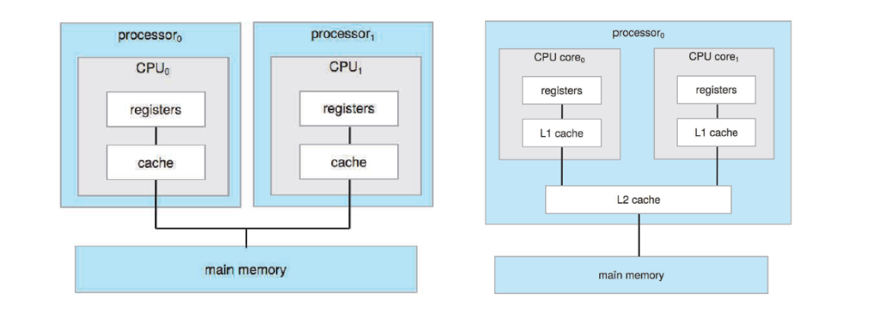
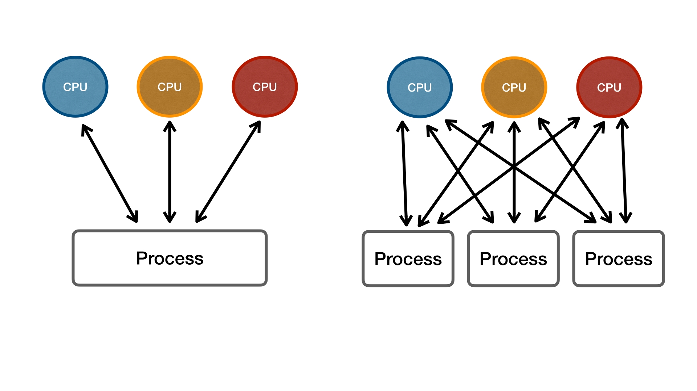

## 목차

1. [Multiprocessing이란?](#multi-processing이란)
2. [Multi-programming이란?](#multi-programming이란)
3. [Multi-threading이란?](#multi-threading이란)
4. [Multicore processor란?](#multicore-processor란)
5. [Multithreaded multicore system이란?](#multithreaded-multicore-sysyem이란)
6. [References](#references)

## Multi-processing이란?
다수의 프로세서가 서로 협력적으로 일을 처리하는 것을 의미한다. 컴퓨터는 1대이지만 프로세서는 2개 이상이다. 멀티코어시스템을 포함한다. SMP, AMP 등이 있다. 

이렇게 여러 프로세서에서 하나의 프로그램을 병렬로 실행하여 실행 속도를 극대화시킨다.

## Multi-programming이란?
프로세서가 입출력 작업의 종료를 대기할 동안, 다른 프로세스을 수행할 수 있도록 하는 것이다.

## Multi-tasking이란?
OS의 스케줄링에 의해 Task를 번갈아가며 수행하는 것을 의미한다. Task란 운영체제에서 처리하는 작업의 단위 또는 정해진 일을 수행하기 위한 명령어 집합을 뜻한다. 멀티 태스킹은 한 개의 프로세서 입장에서 고려한다.

## Multi-threading이란?
여러 개의 스레드끼리 자원을 공유하는 것을 뜻한다.

## Multicore processor란?
하나의 칩에 여러 개의 프로세스 코어가 존재하는 것이다.

## Multithreaded multicore sysyem이란?
Intel의 HyperThreading 기술로 대표되는 시스템이다. 하나의 코어 안에 2개의 하드웨어 스레드가 존재한다. 이 스레드는 입력 작업에 대해서 다른 하나의 스레드가 memory stall cycle를 진행하는 동안, compute cycle를 진행한다. 따라서 운영체제는 실제 코어의 개수 * 2만큼 코어가 존재한다고 판단한다. 

### Multi-programming vs Multi-tasking
멀티 프로그래밍은 프로세서의 자원낭비를 막기 위함이고, 멀티태스킹은 정해진 시간 동안 각각의 task를 번갈아가며 수행하는 것을 의미한다.

### Multi-processing vs Multi-threading
멀티 프로세싱은 fork를 통해 프로세스를 다수 늘려, 여러 개의 프로세스를 병렬로 처리한다. 멀티 스레딩은 하나의 프로세스 안에서 여러 실행을 병렬 처리를 한다.

### Multi-tasking vs Multi-threading
멀티 스레딩은 스레드들끼리의 자원 공유가 가능하며, 프로그래밍을 통해 구현 가능하다. 반면 멀티 태스킹은 OS에서 지원하는 것으로 독립된 메모리를 가지며, 서로 간의 자원 공유가 일어나지 않는다. 자원 공유를 하려면 별도의 IPC를 구현해야 하므로, 운영체제에 부담을 줄 수 있다.

## References
* 2022 봄 운영체제 강의
* 멀티프로세싱, 멀티프로그래밍, 멀티태스킹, 멀티스레딩 - https://velog.io/@chy0428/OS-%EB%A9%80%ED%8B%B0%ED%94%84%EB%A1%9C%EA%B7%B8%EB%9E%98%EB%B0%8D-%EB%A9%80%ED%8B%B0%ED%94%84%EB%A1%9C%EC%84%B8%EC%8B%B1
* Process Scheduling, 배치처리, 멀티태스킹, 멀티프로세싱 - https://velog.io/@underlier12/OS-08-Process-Scheduling
