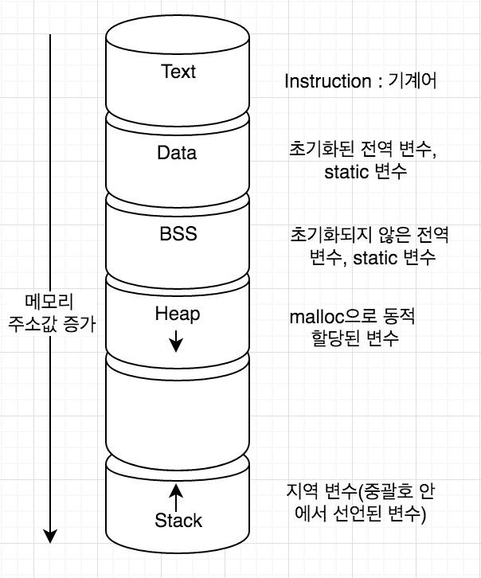

## 목차

1. [프로세스(Process)란?](#프로세스process란)
2. [프로그램과 프로세스](#프로그램과-프로세스)
3. [프로세서와 프로세스](#프로세서와-프로세스)
4. [프로세스 제어블록(PCB, Process Control Block)](#프로세스-제어블록pcb-process-control-block)
5. [프로세스의 상태](#프로세스의-상태)
6. [프로세스 생성](#프로세스-생성)
7. [프로세스 큐](#프로세스-큐)
8. [References](#references)

## 프로세스(Process)란?
컴퓨터에서 연속적으로 실행되고 있는 컴퓨터 프로그램을 말한다. 종종 스케쥴링의 대상이 되는 작업(task)이라는 용어와 거의 같은 의미로 쓰인다. 프로세스 관리를 잘 하는 것이 OS의 중요한 부분이다.

+ CPU context (registers)
+ OS resource (address space, etc.)
+ Other information

## 프로그램과 프로세스
프로그램은 일반적으로 하드 디스크 등에 저장되어 있는 실행코드를 뜻한다. 프로세스는 프로그램을 구동하여 프로그램 자체와 프로그램 상태가 메모리 상에서 실행되는 작업 단위를 지칭한다. 프로그램은 하나지만, 해당 프로세스는 여러 개가 될 수 있다.

## 프로세서와 프로세스
프로세서는 CPU와 같은 중앙처리장치이다. 프로세서는 한 순간에 하나의 프로세스만 실행할 수 있다. 하지만 컴퓨터를 사용하면서 롤, 유튜브, 멜론과 같은 여러 개의 프로세스를 동시에 실행시킬 수 있다. 이는 운영체제가 매우 빠르게 CPU가 실행할 프로세스를 교체하고 있기 때문이다.

## 프로세스 제어블록(PCB, Process Control Block)
프로세스에 대한 정보는 프로세스 제어 블록 또는 프로세스 기술자(Process descriptor)라고 부르는 자료구조에 저장된다. 다음과 같은 정보를 담고 있다.
<details><summary> PCB 정보 </summary>

* PID : Process identification, 운영체제가 각 프로세스를 식별하기 위해 부여한 프로세스 식별번호이다.
* 프로세스 상태 : 프로세스의 상태를 저장한다. 실행, 대기 등의 상태가 있다.
* 프로그램 카운터 : Program Counter, IP. 프로세서가 다음으로 실행할 명령어를 가리키는 값이다. 즉, 다음에 실행할 기계어 코드의 메모리 주소를 가리킨다. 
* 스케줄링 우선순위 : 여러 개의 프로세스가 CPU에서 실행되는 순서를 결정하는 것을 스케줄링이라고 한다. 여기서 우선순위가 높으면 먼저 실행될 수 있다.
* 권한 : 프로세스가 접근할 수 있는 자원을 결정하는 정보이다.
* 부모와 자식 프로세스 : 최초로 생성되는 init 프로세스를 제외하고 모든 프로세스는 부모 프로세스를 복제해서 생성된다. 트리 관계를 형성한다.
* 프로그램 포인터 : 프로그램에 대한 정보를 담은 공간에 대한 포인터이다. 
* 자원 포인터
* 실행문맥 : 마지막으로 실행한 프로세서의 레지스터 내용을 담고 있다. 연속적으로 실행된 것처럼 하기 위해 이 레지스터 정보를 가진다.


</details>

### 메모리 공간


## 프로세스의 상태
커널 내의 자료 구조를 통해 프로세스의 상태를 관리한다. 준비 큐, 대기 큐, 실행 큐 등의 자료 구조가 있다.
* 생성(create) : 프로세스가 생성되는 중이다.
* 실행(running) : 프로세스가 CPU를 차지하여 명령어들이 실행되고 있다.
* 준비(ready) : 프로세스가 CPU를 사용하고 있지는 않지만 언제든지 사용할 수 있는 상태로, CPU가 할당되기를 기다리고 있다. 일반적으로 준비 상태의 프로세스 중 우선순위가 높은 프로세스가 CPU를 할당받는다.
* 대기(waiting) : 보류(block)라고 부르기도 한다. 프로세스가 입출력 완료, 시그널 수신 등 어떤 사건을 기다리고 있는 상태를 말한다.
* 종료(terminated) : 프로세스의 실행이 종료되었다.


### 프로세스의 상태전이
하나의 프로그램이 실행되면 그 프로그램에 대응되는 프로세스가 생성되어 준비 리스트의 끝에 들어간다. 준비 리스트 상의 다른 프로세스들이 CPU를 할당받아 준비 리스트를 떠나면, 그 프로세스는 점차 준비 리스트의 앞으로 나가게 되고 언젠가 CPU를 사용할 수 있게 된다.

* 디스패치(dispatch)
준비 리스트의 맨 앞에 있던 프로세스가 CPU를 점유하게 되는 것, 즉 준비 상태에서 실행 상태로 바뀌는 것을 디스패치라고 하며 다음과 같이 표시한다.
```
    dispatch (processname) : ready → running
```
* 보류(block)
실행 상태의 프로세스가 허가된 시간을 다 쓰기 전에 입출력 동작을 필요로 하는 경우 프로세스는 CPU를 스스로 반납하고 보류 상태로 넘어 간다. 이것을 보류라고 하며 다음과 같이 표시한다.
```
    block (processname) : running → blocked
```
* 깨움(wakeup)
입출력 작업 종료 등 기다리던 사건이 일어났을 때 보류 상태에서 준비 상태로 넘어가는 과정을 깨움이라고 하며 다음과 같이 표시한다.
```
    wakeup (processname) : blocked → ready
```
* 시간제한(timeout)
운영체제는 프로세스가 프로세서를 계속 독점해서 사용하지 못하게 하기 위해 clock interrupt를 두어서 프로세스가 일정 시간동안만 (시분할 시스템의 time slice) 프로세서를 점유할 수 있게 한다
```
    timeout(processname) : running -> ready
```

## 프로세스 생성


부모 프로세스는 자식 프로세스를 생성할 수 있고, 프로세스 계층은 트리 구조를 가진다. 각 프로세스는 process identifier(pid)로 구별 및 관리한다. 여러 가지 옵션이 있다.
* 자원 공유
    * 부모와 자식이 모든 자원을 공유한다.
    * 자식이 부모 자원의 일부분을 공유한다.
    * 자원을 공유하지 않는다.

* 실행 옵션
    * 부모와 자식이 동시에 실행된다.
    * 자식이 종료될 때까지 부모는 기다린다.

* 주소 공간
    * 자식이 부모의 주소 공간을 복제한다.
    * 자식이 중복되는 주소 공간에 새로운 프로그램을 로딩한다.

## 프로세스 큐
운영체제는 시스템에 존재하는 모든 프로세스의 상태를 나타내는 큐를 가지고 있다. 프로세스는 수행하면서 상태가 여러 번 변하는데, 이에 따른 서비스를 받아야하는 곳이 다르다. 더불어 여러 개의 프로세스를 수행할 때, 순서를 정해야 한다. 이러한 순서를 대기하는 곳을 큐라고 부른다. 각 큐 내부에는 각 프로세스의 PCB가 저장되어 있다. 순서를 대기하는 공간이 큐이므로 순서를 정해줘야 한다. 이러한 알고리즘을 스케줄링이라고 한다.

* Job Queue: 하드디스크에 있는 프로그램이 실행되기 위해 메인 메모리의 할당 순서를 기다리는 큐이다.
* Ready Queue: CPU 점유 순서를 기다리는 큐이다.
* Device Queue: I/O를 하기 위한 여러 장치가 있는데, 각 장치를 기다리는 큐가 존재한다.


## Pipe
표준 Producer-Consumer로 소통하는 것이다. Child process가 자신의 출력을 파이프에 입력으로 넣으면, Parent process는 파이프의 출력을 자신의 입력으로 사용한다.

### dup2
파일 서술자(File descriptor) 복제 함수이다.

    #include <unistd.h> 
    int dup2(int oldfd, int newfd); 

+ 표준 입력(0), 표준 출력(1), 표준 오류(2)
+ dup2는 newfd 파일 descripter가 이미 open된 파일이면 close하고 oldfd를 newfd로 복사한다. 이때, newfd와 oldfd는 file descripter 번호는 다르지만 똑같이 행동한다. 그러지만 두 file descriptor는 다른 descriptor이므로 하나를 close한다고 해서 함께 close되지 않는다. 
+ parameter 
    + oldfd : 복사하려는 원본 file descripter
    + newfd : 복사되는 target file descripter (만약 newfd가 열려진 file descripter이면, 먼저 close후에 복사함) 

+ return 
    + 정상인 경우: -1 이외의 값 
    + 오류인 경우: -1 , 오류 상세 내용은 errno 전역변수에 저장됨

UNIX에서는 모든 게 파일으로 관리되기 때문에, 입출력을 파일에 할당해준다.

## References
* 2022 봄 운영체제 강의
* wiki - https://ko.wikipedia.org/wiki/%ED%94%84%EB%A1%9C%EC%84%B8%EC%8A%A4
* Program / Process / Processor - https://enlqn1010.tistory.com/12
* 프로세스가 뭐지? - https://bowbowbow.tistory.com/16
* 프로세스 관리 - https://velog.io/@codemcd/%EC%9A%B4%EC%98%81%EC%B2%B4%EC%A0%9COS-5.-%ED%94%84%EB%A1%9C%EC%84%B8%EC%8A%A4-%EA%B4%80%EB%A6%AC
* [IT 개발자 Note] - https://www.it-note.kr/5 