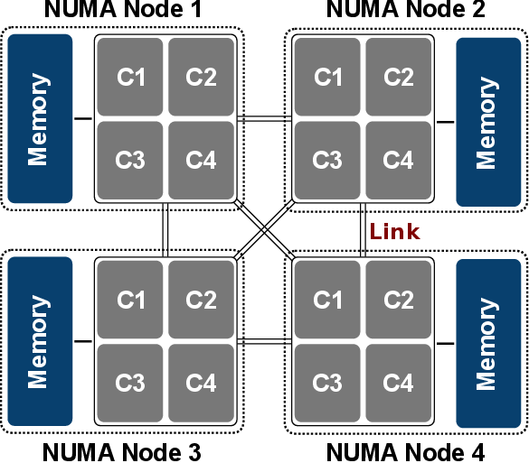

## 목차

1. [General CPU Scheduler](#non-preemptive-scheduling)
2. [Multi-level queue (MLQ)](#multi-level-queue-mlq)
3. [Multi-level feedback queue (MLFQ)](#multi-level-feedback-queue-mlfq)
4. [NUMA and CPU Scheduling](#numa-and-cpu-scheduling)
5. [Multiple-Processor Scheduling - Load Balancing](#multiple-processor-scheduling---load-balancing)
6. [References](#references)

## General CPU Scheduler
일반적인 상황에서의 CPU 스케쥴러를 고려한다.

### Priority Scheduling
우선순위에 따라 작업을 처리한다. 경우에 따라 Preemptive, non-preemptive를 오간다. 높은 우선순위의 작업이 계속 들어오면 낮은 우선순위의 작업이 starvation이 된다.

### Incorporating I/O
I/O 사용이 가능한 스케쥴링을 고려함에 따라 '가정 4. 모든 작업은 CPU만 사용한다.'를 폐기한다. CPU와 I/O가 상호작용하는 작업 A와 CPU만 사용하는 작업 B가 있다. 그렇다면 A가 CPU를 사용한 뒤, I/O 작업을 한다면 이 작업을 하는 동안 B를 실행시킨다.

### Goals & Challenge
Turnaround time과 Response time을 최적화 하는 것을 목표로 한다. 하지만 시간이 얼마나 걸리는지 모르는 프로세스의 작업이 들어온다. (가정 5. 각 작업의 모든 실행 시간은 알고 있다. -> 폐기) \
그렇기 때문에 RR이 자주 사용된다. 과거의 패턴을 분석해 작업을 예측하는 방법도 있다.(branch predictors or cache algorithms) 그런데 os 특성 상 빠르게 진단하고 결정을 내려야하기 때문에, 알고리즘적으로 완벽하지 않아도 간단하면서 효과적인 알고리즘을 활용하는 편이다.

* * * 

## Multi-level queue (MLQ)
MLQ는 프로세스를 특정 그룹으로 분류하고, 각 그룹에 따라 다른 준비 큐를 이용하는 스케쥴링이다. 각 준비 큐는 각기 다른 스케쥴링 알고리즘을 가질 수 있으며, 큐와 큐 사이에도 스케쥴링 알고리즘이 필요하다.

+ 전면 작업(대화형)과 후면 작업(일괄처리형)으로 분류한다면, 두 유형의 반응 시간이 다르므로 서로 다르게 스케쥴링 해야한다.

각 큐는 절대적인 우선순위를 가진다. 일괄 처리 프로세스는 위에 있는 프로세스들을 위한 큐들이 전부 비어 있어야 실행된다. 그리고 실행되는 동안에 대화식 편집 프로세스가 들어오면 프로세서를 반납해야 한다. 그러므로 Starvation이 발생할 수 있다.

* * *

## Multi-level feedback queue (MLFQ)
MLQ에서 큐와 큐 사이 이동이 가능하도록 한 스케쥴링이다. 
+ 특정 프로세스가 CPU를 너무 많이 사용하면 우선 순위가 낮은 큐로 이동한다. 
    + 실행 시간이 길 때
    + 한 번의 Time slice 안에 프로세스의 실행이 끝나지 않을 때
+ 우선 순위가 낮은 큐에서 너무 오래 대기하는 프로세스가 있다면, 해당 프로세스는 우선순위가 높은 큐로 이동한다. 

이렇게 우선순위가 높은 프로세스에게는 불이익을, 낮은 프로세스 에게는 이익을 제공한다. \
기본적으로 우선순위가 낮은 큐를 제외하고는 모두 RR 스케쥴링을 사용한다. 가장 우선순위가 낮은 큐는 FIFO 또는 RR을 사용한다. 우선순위가 높은 큐일수록 짧은 Time slice가 주어지고, 우선순위가 낮은 큐일수록 긴 Time slice가 주어진다. 

* * *

## NUMA and CPU Scheduling
Non-Uniform Memory Access(뷸균일 기억 장치 접근), 멀티프로세서 시스템에서 사용되고 있는 컴퓨터 메모리 설계 방법이다. 1개의 프로세서와 메모리 등을 통틀어 노드라는 단위를 쓴다. 각 노드 내에서 프로세서에 가까운 메모리는 빠르게 접근할 수 있지만, 멀리 있는 다른 노드의 메모리는 느리게 접근한다. (다른 노드의 CPU를 통해서 접근) 

CPU 스케쥴러는 이에 대해서 작업을 좀 더 빠르게 하기 위해서, 다른 노드의 메모리에 직접 접근하지 않고 인터페이스를 통해 작업을 다른 노드에 할당할 수 있다. 현재 노드의 메모리가 꽉차면 다른 노드의 메모리에 할당하고, 그 노드에서 작업을 처리할 수도 있다. 이렇게 다른 노드의 메모리에 할당된 메모리는 메모리 관리자가 현재 노드로 다시 가져오는 작업을 한다.     

* * *

## Multiple-Processor Scheduling - Load Balancing
여러 개의 CPU에 작업을 골고루 분산해, 효율을 높이는 방법이다. 다음의 문제를 해결해야 한다.

+ Cache coherence: 캐시 일관성, 캐시끼리 데이터를 일관성있게 유지해야 하는 문제이다.
    + 가장 기본적인 해결 방법은 메모리 접근을 모니터링하는 것이다. 각각의 캐시는 메인 메모리에 연결한 버스를 관찰하고 메모리 업데이트를 관찰한다. 그런 뒤 CPU가 캐시에서 데이터를 수정하면 그것을 인식하여, 나중에 메모리가 캐시에서 수정된 데이터를 가져올 때 적절히 처리할 수 있도록 한다.
    + Synchronization: CPU에서 공유 데이터에 접근할 때, mutual exclusive를 사용하여 정확성을 보장해준다.
+ Cache affinity: 캐시 선호도, 스케쥴러는 프로세스가 동일한 CPU에서 계속 실행되도록 해줘야 한다.  
    + 특정 CPU에서 프로세스를 수행하면 해당 프로세스는 해당 CPU의 캐시에 여러 가지 데이터를 저장한다. 다음에 수행할 때, 해당 프로세스가 다른 CPU에서 수행되면 필요한 데이터를 이전 CPU에서 가져온다. 이렇게 되면 성능 저하가 발생한다. 이를 방지하기 위함이다.

### Single Queue Multiprocessor Scheduling (SQMS)

+ 캐시 친화도 적용 X
+ 모든 프로세스에 대해 적용할 수 없으며, 일부 프로세스에만 캐시 친화도 적용 가능

### Multi-Queue Multiprocessor Scheduling (MQMS)

+ 캐시 친화도 적용 O
+ Load imbalance(부하 불균형): 특정 프로세서에게만 부하가 생긴다. 

이러한 문제를 해결하기 위해서, 과부화된 CPU에서 다른 CPU에게 작업을 밀어 넣거나, 대기 중인 CPU가 다른 CPU의 대기 작업을 가져온다. 이를 Migration이라고 한다.

+ Push migration - 과부화된 CPU에서 다른 CPU에게 작업을 밀어넣는다.
+ Pull migration - 대기 중인 CPU에서 다른 바쁜 CPU의 대기 작업을 가져온다.

이렇게 하면 Load balance가 지켜진다. Migration을 하는 동안, 어떤 프로세스를 어디로 이동할 것인지는 Work stealing(작업 훔치기, Threads에서도 사용한다.)를 사용한다. 하지만 너무 자주 하면 SQMS에서 있었던 Lock에 의한 오버헤드와 확장 문제가 동일하게 발생한다. 따라서 적절히 조율하는 값을 찾아야 한다.

* * *

## References
* 2022 봄 운영체제 강의
* MLQ & MFQ - http://itnovice1.blogspot.com/2019/08/multi-level-queue.html
* 멀티 프로세서 스케쥴링 - https://icksw.tistory.com/127