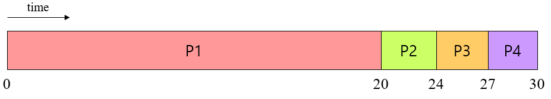
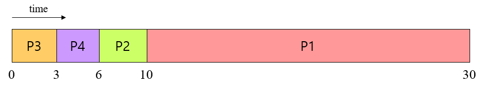
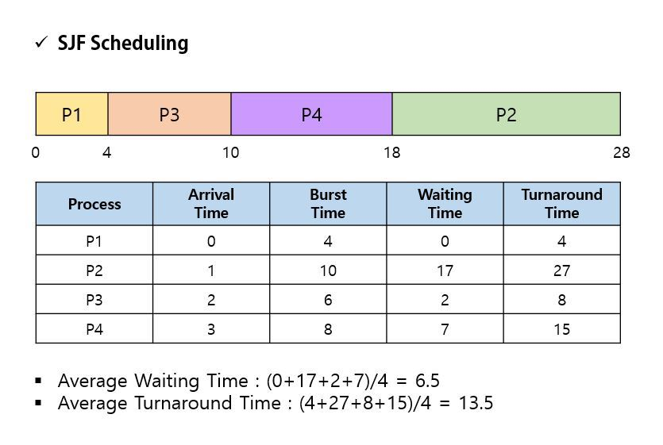

## 목차

1. [Non-preemptive scheduling](#non-preemptive-scheduling)
2. [FIFO](#fifo)
3. [Shortest Job First (SJF)](#shortest-job-first-sjf)
4. [References](#references)

## Non-preemptive scheduling
스케쥴러는 현재 실행 중인 프로세스가 자발적으로 CPU를 내려놓는 것을 기다린다. 필요한 문맥 교환만 일어나기 때문에 오버헤드가 상대적으로 적지만, 프로세스의 배치에 따라 효율성 차이가 많이 난다. 프로세스들이 협력적으로 실행되어야 하는데, 비협력적인 프로세스가 있다면?

## FIFO

First-In, First-Out. First-Come, First-Served(FCFS)라고도 한다. 각 작업은 먼저 도착했으면 먼저 실행된다. Non-preemptive 접근법이다. 특정 작업만 실행되지 않는다.(no starvation) 

+ 예제의 실행 시간
    + P1 - 20, P2 - 4, P3 - 3, P4 - 3 (단위 없음의 주의)

+ 반환 시간: P1 - 20, P2 - 24, P3 - 27, P4 - 30
    + 평균 반환 시간: (20 + 24 + 27 + 30) / 4 = 25.25
+ 대기 시간: P1 - 0, P2 - 20, P3 - 24, P4 - 27
    + 평균 대기 시간: (0 + 20 + 24 + 27) / 4 = 17.75
+ 응답 시간: 대기 시간과 같다. 평균 응답 시간도 같다.

+ FIFO를 최적화한 것이다.
+ 반환 시간: P1 - 30, P2 - 10, P3 - 3, P4 - 6
    + 평균 반환 시간: (30 + 10 + 3 + 6) / 4 = 12.25
+ 대기 시간: P1 - 10, P2 - 6, P3 - 0, P4 - 3
    + 평균 대기 시간: (10 + 6 + 0 + 3) / 4 = 4.75
+ 응답 시간: 대기 시간과 같다. 평균 응답 시간도 같다.

=> Convoy effect, 대기 작업 줄이 늘어지는 단점이 있다. 그리고 작은 작업 앞에 큰 작업들이 존재하면 평균 대기 시간이 길어진다. 그리고 CPU 작업이 크면 I/O 작업이 놀게 된다. 반대로 I/O 작업이 많으면 이를 기다리느라 CPU가 놀게 된다. 선점이 불가능하기 때문이다.  

## Shortest Job First (SJF)
각각의 작업이 서로 다른 실행 시간을 가진다. (가정 1. 각자의 프로세스는 동일한 시간이 걸린다. -> 폐기) \
가장 작은 실행 시간을 가진 작업을 고르는 스케쥴 방식이다. 가정한 상태에서는 최적의 Turnaround time을 가진다. Non-preemptive 접근법이다. 따라서 큰 작업 실행 도중, 매우 작은 작업이 들어왔다하더라도 큰 작업을 중단하고 실행할 수 없다.

+ 예제의 실행 시간
    + P1 - 20, P2 - 4, P3 - 3, P4 - 3

+ 앞서 Optimal FIFO와 같다.
+ 반환 시간: P1 - 30, P2 - 10, P3 - 3, P4 - 6
    + 평균 반환 시간: (30 + 10 + 3 + 6) / 4 = 12.25
+ 대기 시간: P1 - 10, P2 - 6, P3 - 0, P4 - 3
    + 평균 대기 시간: (10 + 6 + 0 + 3) / 4 = 4.75
+ 응답 시간: 대기 시간과 같다. 평균 응답 시간도 같다.

* * *

## References
* 2022 봄 운영체제 강의
* Three Dash Two Four - https://3-24.github.io/system/scheduler-policy/
* PROJECT REBAS - https://rebas.kr/863