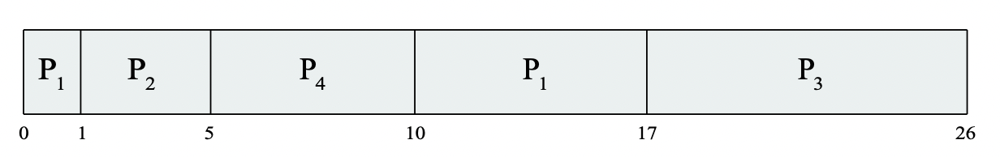
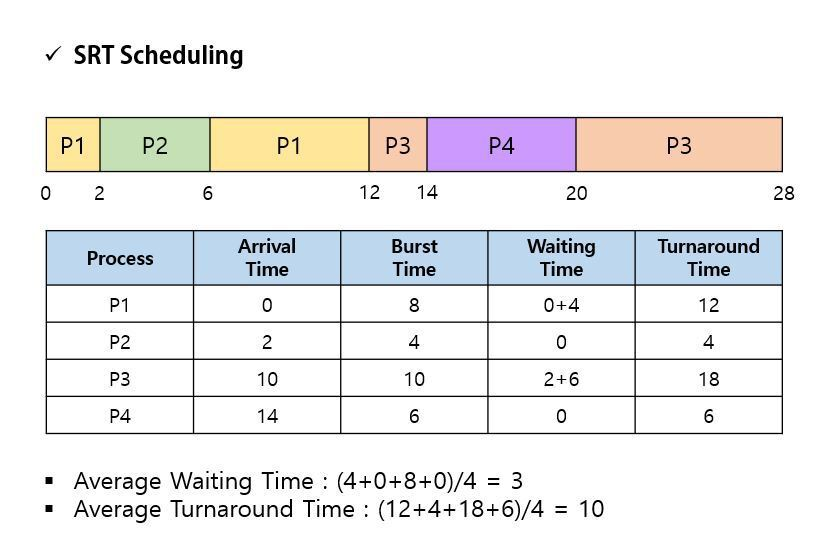
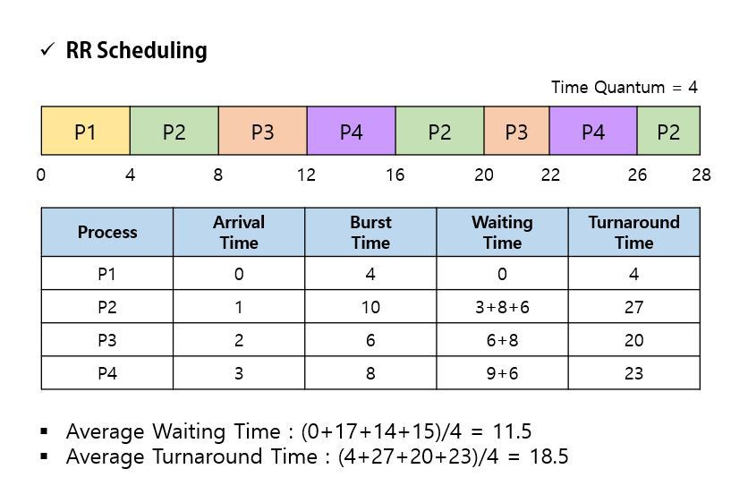

## 목차

1. [Peemptive scheduling](#preemptive-scheduling)
2. [Shortest-next-CPU-burst (STCF)](#shortest-next-cpu-burst-stcf)
3. [Shortest Job First (SJF)](#shortest-job-first-sjf)
4. [References](#references)

## Preepmtive scheduling
스케쥴러가 프로세스에 간섭하며, 강제로 context switch를 진행한다.

## Shortest-next-CPU-burst (STCF)
Shortest Remaining Time Scheduling (SRT)라고도 한다.
+ 작업은 동시에 도착하지 않아도 된다. (가정 2. 모든 작업은 동시에 도착했다. -> 폐기)
+ SJF의 Preemptive 버전이다. Arrival time이 추가된다. (가정 3. 한 번 실행되면, 각 작업은 완료될 때까지 실행된다. -> 폐기) 

새로운 작업의 실행 시간이 현재 작업의 남은 실행 시간보다 작다면, 현재 작업을 중단하고 새로운 작업을 실행시킨다.

+ 예제의 실행 시간
    + P(도착 시간, 실행 시간)
    + P1(0, 8), P2(1, 4), P3(2, 9), P4(3, 5)

+ 반환 시간
    + P1 - (17 + 8) = 26
    + P2 - (0 + 4) = 4
    + P3 - (17 - 2 + 9) = 24
    + P4 - (5 - 3 + 5) = 7
    + 평균 반환 시간: (26 + 4 + 24 + 7) / 4 = 15.25
+ 대기 시간
    + P1 - (10 - 1) = 9
    + P2 - 0
    + P3 - (17 - 2) = 15
    + P4 - (5 - 3) = 2
    + 평균 대기 시간: (9 + 0 + 15 + 2) / 4 = 6.5
+ 응답 시간
    + P1 - 0
    + P2 - 0
    + P3 - (17 - 2) = 15
    + P4 - (5 - 3) = 2
    + 평균 응답 시간: (0 + 0 + 15 + 2) / 4 = 4.25

### Round Robin
각 작업을 Time slice(또는 Time quantum)이라는 시간 단위로 자른다. 작업을 실행하다가 이 시간이 지나면 다음 작업으로 넘어간다. 이를 위해 OS는 tick을 활용해 시그널을 보낸다.

+ Time slice가 너무 짧으면 context switch overhead가 높아진다.
+ Time slice가 너무 길면 responsive가 떨어진다.
+ Time slice는 context switch 시간보다는 길어야한다.
    + 보통 Time slice는 과거 10ms ~ 100ms, 요즘은 1ms 이상이다. Context switch는 보통 10 usec 이하의 시간을 필요로 한다.

+ 응답 시간
    + P1 - 0
    + P2 - (4 - 1) = 3
    + P3 - (8 - 2) = 6
    + P4 - (12 - 3) = 9
    + 평균 응답 시간: (0 + 3 + 6 + 9) / 4 = 4.5

Circular FIFO queue 구조를 가지므로 no starvation이다. 그리고 Response time을 향상 시킬 수 있는 기본적인 방법이다. 만약 ready queue에 프로세스가 없고 run queue에만 프로세스가 1개 있을 경우, context switch 없이 실행을 계속한다. 

RR은 Metric이 response time에 초점이 맞춰져있다. Reponse time = First-run time - Arrival time이다. RR은 SJF보다 높은 turnaround time을 가지지만, response time은 더 좋다.   

* * *

## References
* 2022 봄 운영체제 강의
* PROJECT REBAS - https://rebas.kr/863