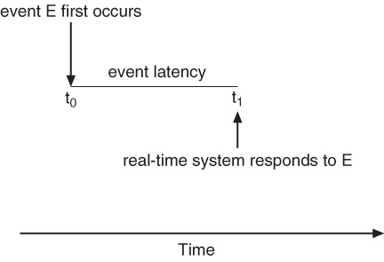
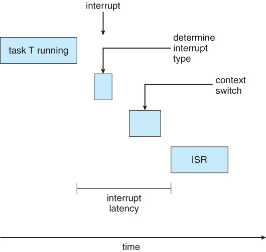
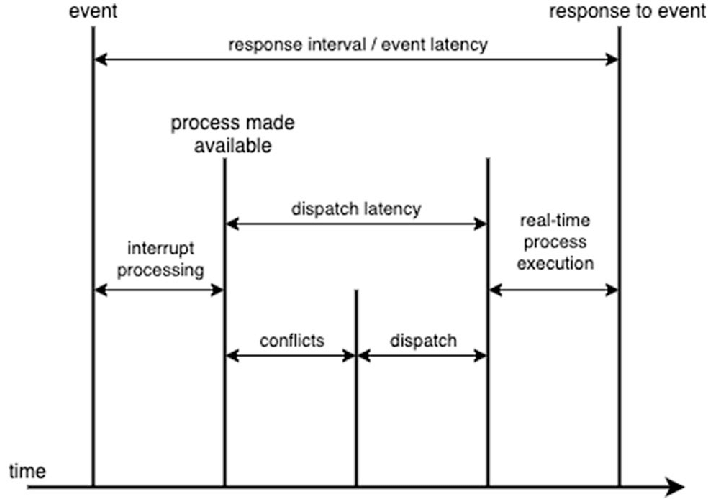
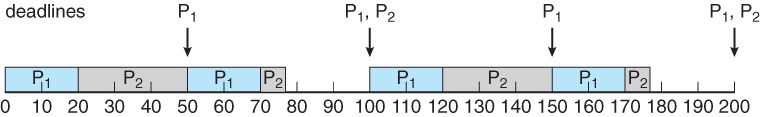
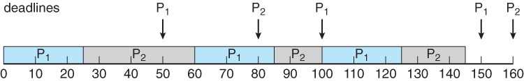

## 목차

1. [Real-Time CPU Scheduling](#real-time-cpu-scheduling)
2. [Rate monotic scheduling](#rate-monotic-scheduling)
3. [Earliest deadline first scheduling](#earliest-deadline-first-scheduling)
4. [Proportional Share Scheduling](#proportional-share-scheduling)
5. [Algorithm evaluation](#algorithm-evaluation)
6. [예측](#예측)
7. [References](#references)

## Real-Time CPU Scheduling
1. Event latency - 이벤트가 발생하고 시스템이 응답하기까지의 시간이다.

2. Interrupt latency - interrupt가 발생해서 interrupt service routine이 제공되는 데 걸리는 시간이다. 밑의 두 단계로 소모되는 시간이다.
    + Determine interrupt type: 어떤 Interrupt가 발생할 지, 어떤 Interrupt handler routine이 실행될 지 결정한다. 동시에 Interrupt가 발생하는 경우, 어떤 ISR이 가장 높은 우선 순위를 가지며 다음에 시작할 지 결정하기 위해 우선 순위 정책이 필요하다.
    + Context switch: CPU로부터 실행 중인 Process를 제거하고, 그 Process의 상태를 저장한 뒤에 ISR이 실행할 수 있도록 적재한다.

3. Dispath latency - 현재 실행 중인 프로세스에서 다음 프로세스로 스케쥴하는 데 걸리는 시간이다. 실행 중인 Process를 제거하고, ISR에 필요한 리소스를 확보하고, ISR를 CPU에 적재할 때까지의 시간이다.
    + Kernel mode에서 프로세스를 선점하는데 걸리는 시간
    + 우선순위가 낮은 프로세스의 자원을 반환받고, 그 자원을 선점하는데 걸리는 시간

### Soft real-time systems
작업이 Deadline을 무조건 맞출 필요까지는 없다. 처리 시간이 달라지면 성능이 감소한다.
+ 비디오 스트리밍

### Hard real-time systems
작업은 Deadline을 무조건 맞춰야한다. 처리 시간이 달라지면 실패하는 경우이다.
+ 자동차의 에어백

### Priority-based Scheduling in Real-time
스케쥴러는 Preemptive를 지원해야하므로 우선순위 기반 스케쥴링을 한다. Hard real-time에서는 deadlines에 대한 스케쥴링도 제공해야한다. 따라서 주기 안에 돌아갈 수 있는 프로세스만 받는다.

+ 정해진 시간마다 CPU를 요구하는 p(periodic)
+ 프로세스의 deadline을 뜻하는 d
+ 실제 실행 시간 t

0 <= t <= d <= p

## Rate monotic scheduling
정적 우선순위의 선점형 알고리즘이다. 우선순위가 period의 역으로 매겨진다. Period가 짧으면 높은 우선순위, period가 길면 낮은 우선순위를 가진다. P(period, processing time)을 입력값으로 한다. 

+ P1(50, 20)
+ P2(100, 35)

이 알고리즘으로 스케쥴링 할 수 없는 프로세스 집합은 다른 정적 우선순위 스케쥴로도 스케쥴링 할 수 없다.

이론적으로 RMS의 CPU 활용도이다. n이 커지면 커질수록, 활용도는 최대 69%이다. 각 n의 Upper bound라고 생각하면 된다.

## Earliest deadline first scheduling
EDF라고 한다. 우선순위가 deadline에 따라 부여된다. Deadline이 짧으면 높은 우선순위, 낮으면 낮은 우선순위이다.

Ready queue에 프로세스가 들어올 때마다 deadline을 확인해야 해서 overhead가 크다.

## Proportional Share Scheduling
프로세스마다 CPU를 일부분 점유한다. 새로운 프로세스가 CPU 점유를 요청했는데, 이를 수용 시 100%가 넘치면 관리 컨트롤러가 요구를 거부한다. 그리고 필요한 점유율을 보장하지 못 할 경우, 작업을 시작하지 않는다. Virtualied System에서 주로 사용한다. 

+ Virtual CPU의 스케쥴링
+ Virtual CPU와 Physical CPU 간의 스케쥴링 

## Algorithm evaluation
1. Criteria를 정한다.
2. Algorithm을 고려한다.
3. Modeling을 고려한다.
    + 각 알고리즘의 평균 대기 시간 중, 최소값을 계산한다.
    + Queue에 관련된 시간들을 수학적으로 계산한다.
    + Simulations
    + Implementation, 실제 시스템에 테스트 해보는 것은 비용이 굉장히 비싸다.

## 예측
+ Queueing model
+ Simulation
+ Implementation

### Little's formula
고정 시스템에서 고객의 장기 평균 수가, 장기 평균 유효 도착률에 고객이 시스템에서 소비하는 평균 시간을 곱한 것과 같다는 John Little의 정리이다.

+ n = 평균 큐의 길이
+ W = 큐의 평균 대기 시간
+ λ = 큐의 평균 도착 비율
+ n = λ x W
* * *

## References
* 2022 봄 운영체제 강의
* MLQ & MFQ - http://itnovice1.blogspot.com/2019/08/multi-level-queue.html
* 멀티 프로세서 스케쥴링 - https://icksw.tistory.com/127
* Real-Time CPU Scheduling - https://lazymankook.tistory.com/49
