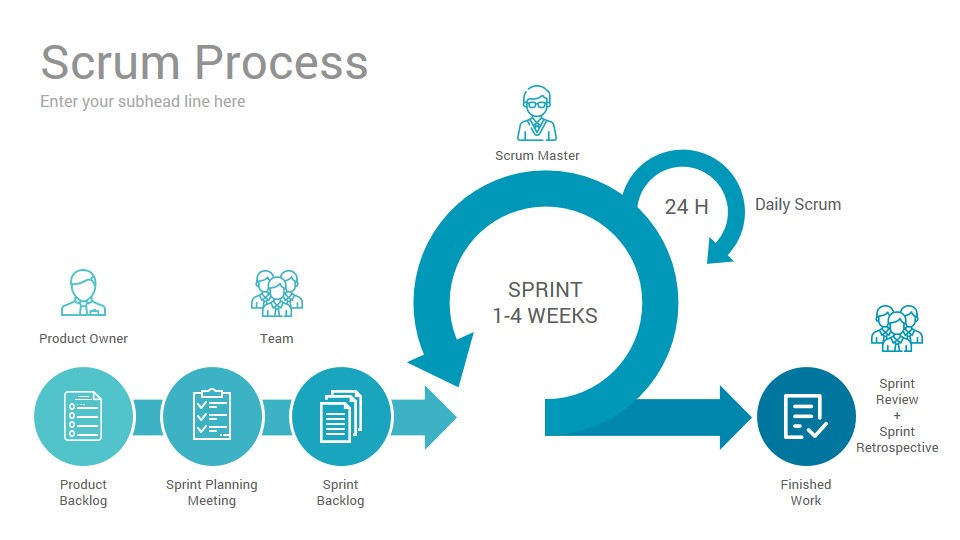

## 목차

1. [주먹구구식 모델](#주먹구구식-모델)
2. [폭포수 모델](#폭포수-모델)
3. [V 모델](#v-모델)
4. [진화적 프로세스 모델](#진화적-프로세스-모델)
5. [반복적 개발 방법론](#반복적-개발-방법론)
6. [References](#references)

## 애자일 프로세스
기존의 전통적인 개발 방법론이 가진 한계를 극복하고자 새롭게 나온 개발 방법론을 통칭하여 부르는 개발 프로세스의 이름이다. Agiled의 뜻(날렵한, 민첩한)처럼 고객의 요구에 민첩하게 대응하고, 그때그때 주어지는 문제를 풀어나가는 방법론이다. 2001년도에 각 방법론의 전문가들이 모여서 애자일 방법론이란 것을 발표했다.

    '개인과 상호작용'을 프로세스와 도구 보다는 우선적으로 한다.
    '작동하는 소프트웨어'를 포괄적인 문서화보다 우선적으로 한다.
    '고객과의 협업'을 계약에 대한 협상보다 우선적으로 한다.
    '변화에 대한 대응'을 계획에 따르는 것보다는 우선적으로 한다.

애자일 프로세스에 대한 원칙

+ 우리의 우선적인 목표는 가치 있는 SW를 지속적으로 조기에 제공하는 것이다.
+ 우리는 개발 후반부의 요구사항 변화도 환영한다. 애자일 프로세스는 고객의 경쟁력을 위해서 변화를 수용한다.
+ 짧은 스케줄을 선호하여 동작 가능한 SW를 2주에서 2달 간격으로 제공을 한다.
+ 업무 담당자와 개발자는 매일 같이 프로젝트 기간 동안 일해야 한다.
+ 동기 부여된 사람들로 프로젝트 팀을 구성한다.
그들에게 적절한 환경과 자원을 지원해 주고 일을 잘 할 수 있도록 믿어 준다.
+ 가장 효과적인 의사소통 수단은 직접 만나서 의사소통하는 것이다.
+ 진척사항을 나타내는 중요한 척도는 작동 가능한 SW이다.
+ 애자일은 지속 가능한 개발을 촉진한다. 후원자, 개발자, 사용자는 일정한 속도를 지속적으로 유지해야 한다.
+ 뛰어난 기술과 좋은 설계에 대한 지속적인 관심은 기민성을 강화시킨다.
+ 단순함(꼭 필요하지 않은 것을 최대한 덜 개발하는 기술)은 필수이다.
+ 최고의 아키텍처, 요구사항, 설계는 자율적인 팀에서 나온다.
+ 정기적으로 팀이 어떻게 하면 보다 효과적이 될 수 있는지 조율하고 수정한다.

### 폭포수 모델과 애자일 방법론 간 주요 차이점
1. 계획 중심 vs 고객 중심
    + 폭포수 방법론은 프로젝트를 시작하기 전에 프로젝트 기간 전체에 대한 일정 계획을 수립하며, 이 계획에 따라 프로젝트를 진행한다.
    + 애자일 방법론은 계획을 수립하되, 현재 시점에 고객에게 중요하거나 확정된 내용을 중심적으로 수립한다. 프로젝트 상황에 따라 계획은 변경될 수 있다.
2. 빅뱅 릴리즈 vs 작은 릴리즈
    + 폭포수 방법론은 프로젝트가 종료되는 시점에 한꺼번에 모든 기능을 릴리즈한다.
    + 애자일 방법론은 이터레이션이라는 일정 기간 단위로 작은 규모 크기의 릴리즈를 반복한다. 고객의 요구사항을 제대로 반영하고 있는지를 빠르게 확인하여 재개발을 방지한다.
3. 산출물 중심 vs 동작하는 SW 중심
    + 폭포수 방법론에서는 계획된 단계별로 지정된 산출물이 작성되었는지 여부를 확인함으로써 프로젝트가 제대로 진행되고 있는지를 확인한다.
    + 애자일 방법론에서는 소프트웨어가 제대로 동작하는지, 얼마나 요구사함에 맞게 개발되었는지가 중요하다.
    + 문서는 작성을 안하는게 아니라, 상황에 맞는 다양한 형태로 산출물을 만들 수 있는 것이다.

### 각 애자일 방법론별 특징
Scrum 같은 경우에는 프로젝트 관리 방법론에 치중하고 있고, XP의 경우에는 개발 기술에 치중하고 있다. 따라서 여러 가지 애자일 방법론을 섞어서 사용하는 경우도 많다.

대표적인 애자일 방법론 

- 스크럼(Scrum) : 켄 슈와버/제프 서덜랜드
- 적응형 소프트웨어 개발 방법론(Adaptive Software Development, ASD) : 짐 하이스미스
- 기능 주도 개발방법론(Feature Driven Development, FDD) : 피터 코드/제프 드루카
- 동적 시스템 개발 방법론(Dynamic Systems Development Method, DSDM) : 데 인 포크너 외
- 크리스탈 패밀리(Crystal Family) : 앨리스테어 코번
- 익스트림 프로그래밍(eXtreme Programing, XP) : 켄트 벡/에릭 감마
- 린(Lean) 소프트웨어 개발방법론 : 메리 포펜딕/톰 포펜딕
- 애자일 UP(Agile Unified Process, AUP) : 스콧 앰블러

### 애자일 방법론의 한계
애자일 방법론은 만능이 아니다. 따라서 주어진 상황을 고려하여 선택해야한다. 자기 자신의 제품을 만드는 데는 애자일을 도입하는 것에 큰 장벽이 없지만, 남의 제품을 만들어 주는 경우에는 애자일을 도입하는 것이 어렵다. \
발주자와 수행업체 관계일 경우, 서로 계약관계에 따른 문서화된 산출물이 중요한 근거 자료가 되기 때문이다. 또한 개발하는 동안 감리를 받아야 하는데, 어떠한 근거로 감리를 해야할 지도 모호할 수 있다. 더불어 고객의 요구사항을 무한정 받아주는 것은 쉬운 것이 아니다. (국방 관련 프로젝트를 고려해보자.)

## 스크럼
Scrum, 프로세스를 계속 반복하여 문제를 발견하고 다시 수정하는 작업을 되풀이 하면서 목표를 향해 전진하는 것이다. 서로 다른 직군의 전문가가 모여 협업팀을 구성한다.

### 구성
+ 제품 책임자: 제품 개발 계획의 변경사항과 개발 가능한 기능의 우선순위를 수집하여 정리한다.

+ 제품 백로그: 제품 책임자가 작성하는 주요 기능에 대한 리스트이다. 주요 기능 중 무엇부터 구현해야하는 지에 대한 우선 순위도 정리되어 있다.
    + 스토리 포인트: 기능의 난이도를 정량화한다.
    + 중요도: 개발 기능의 우선도를 나타낸다.

+ 스프린트 백로그: 스프린트 계획 미팅을 통해서 결정한, 구현에 대한 세부 작업 리스트이다. 누가, 언제까지, 무엇을 개발할 것인지를 정의한다.
    + MD: Man / Date

+ 스프린트: 1 ~ 4주 사이의 주기를 가지는 개발 주기이다.

+ 스프린트 회고: 스프린트가 몇 개가 끝나거나, 모두 끝나고 나면 해당 스프린트 운영, 요구사항 변경 등에 대한 피드백을 진행한다.

+ 번다운/업(소멸) 차트: 개발 일정에 대한 추적 그래프이다. 남은 작업량으로 하면 번다운, 해결한 작업량으로 하면 번업이다.
    + 가로축: 시간 축으로 스프린트 반복 주기 날짜 수
    + 세로축: 완료된 작업의 추정 일수(스토리 포인트로 표현)
    + 계획 그래프: 처음 계획을 세웠을 때 날짜별로 남은 작업량 (점선)
    + 실제 그래프: 작업을 수행하면서 날짜별로 실제 남은 작업량 (실선)

### 미팅 
+ 스프린트 계획 미팅: 스프린트 때마다 무엇을 구현할 것인지 회의한다. 구현에 대한 세부적인 내용도 회의한다. 스프린트 개발 시간도 추정한다.
+ 데일리 스크럼: 어제 무엇을 했는지, 오늘은 무엇을 할 것인지, 개발 이슈는 무엇인지 등을 공유하는 일일 회의이다. 15분 정도로 짧게 진행한다.
+ 스프린트 리뷰: 스프린트 1주기가 끝나고 나면 해당 스프린트 목표를 달성 했는지, 구현한 기능 등에 대한 피드백을 진행한다. 고객과 같이 진행한다.

### 특징
스프린트가 반복되어 실행될 때마다 제품 백로그에서 가장 높은 우선 순위의 기능을 스프린트 백로그로 이동시킨다.

## 현장고객
고객이 개발팀과 같은 장소에서 함께 개발에 참여하는 것이다. 개발팀의 결과물에 대해 신속하게 피드백을 해줌으로써 개발팀이 엉뚱한 작업을 하지 않도록 도와준다.

+ 고객의 요구가 모호하여 업무를 추진하기가 어려울 때
+ 고객이 원하는 기능의 수준을 파악할 수 없을 때

## 사용자 스토리
개발해야 할 대상 제품이나 서비스의 기능을 정의하는 방식으로, 사용자 입장에서의 비즈니스적인 가치를 정의하는데 초첨을 두고 요구사항을 정리하는 실천법이다. 

+ 고객이 쉽게 이해할 수 있도록 요구사항을 작성하고 싶을 때
+ 사용자의 요구사항이 명확히 드러나있지 않아 고객과 대화하며 상세화 하기 위해

## 플래닝 포커
사용자 스토리의 규모를 추정하는 방식이다. 팀 전체가 같이 지혜를 모아 업무량을 추정하는 실천법을 의미한다. 일정기간, 이상적인 일자, 스토리 포인트 등을 정할 때, 누군가가 숫자를 말하는 순간 판단이 흐려질 수 있다. 따라서 각자의 의견을 정확히 반영하기 위해서, 숫자가 쓰여진 카드로 진행한다.

+ 가장 높은 숫자와 가장 낮은 숫자를 제시한 사람들에게는 왜 그런 산정을 했는지 타당한 이유를 제시하고 토론을 계속한다.
+ 킹 카드는 이번 스프린트 때는 논의하지 말자는 뜻이다. 산정하기에 너무 덩치가 크다거나 복잡하다고 판단한다.

## 추정
사용자 스토리를 구현하는데 그 규모가 어느 정도인지 생각해보는 과정이다. 실제 수행한 것을 기반으로 공수를 추정할 수 있는 스토리 포인트를 사용한다.

+ 공수: 일정한 작업에 필요한 인원수를 노동시간 또는 노동일로 나눈 수치

## 짝 프로그래밍
두 명의 작업자가 한 개의 PC 및 작업 공간을 공유하며 작업하는 것이다. 키보드를 소유하고 작업을 진행하는 사람은 드라이버, 직접 작업을 하지 않지만 목표의 방향을 점검하고 드라이버의 작업을 검토하며 리드하는 사람을 네비게이터라고 한다.

+ 비슷한 실력의 개발자가 어려운 기능을 함께 개발할 때
+ 팀원의 실력을 상향 평준화 하고 싶을 때
+ 신입 개발자를 팀 내에 빠르게 적응시킬 때

## 스프린트 리뷰
스프린트 끝에 고객의 요구사항이 동작하는 기능으로 구현이 되면 스프린트 리뷰를 통해 구현된 기능을 고객에게 보여주고 신뢰와 피드백을 이끌어내는 활동이다.

## 회고
Retrospective, 일정기간 동안 프로젝트를 수행한 뒤, 팀이 프로세스를 개선하고 추후 동일한 문제점을 반복하지 않기 위해서 실시한다.

## References
* 2022 봄 소프트웨어공학 강의