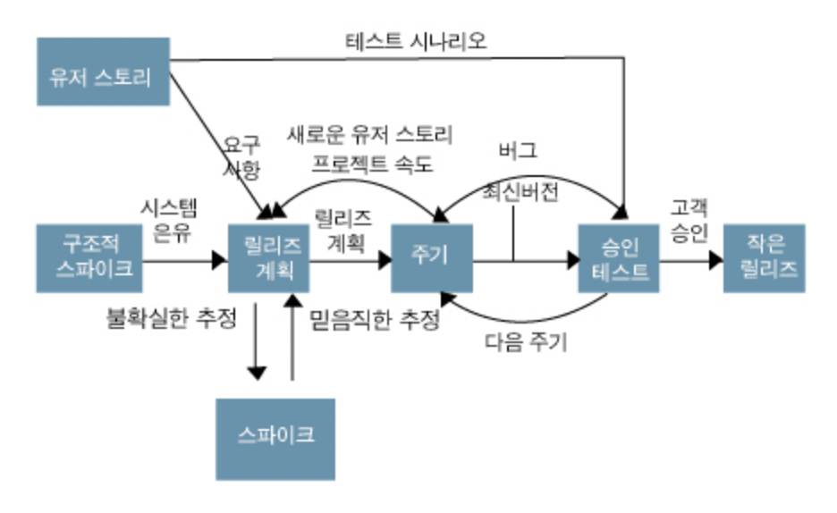

## 목차

1. [스크럼](#스크럼)
2. [XP](#XP)
3. [스크림과 XP 구성](#스크럼과-xp의-구성)
4. [References](#references)

## 스크럼
Scrum, 프로세스를 계속 반복하여 문제를 발견하고 다시 수정하는 작업을 되풀이 하면서 목표를 향해 전진하는 것이다. 서로 다른 직군의 전문가가 모여 협업팀을 구성한다.

### 구성
+ 제품 책임자: 제품 개발 계획의 변경사항과 개발 가능한 기능의 우선순위를 수집하여 정리한다.

+ 제품 백로그: 제품 책임자가 작성하는 주요 기능에 대한 리스트이다. 주요 기능 중 무엇부터 구현해야하는 지에 대한 우선 순위도 정리되어 있다.
    + 스토리 포인트: 기능의 난이도를 정량화한다.
    + 중요도: 개발 기능의 우선도를 나타낸다.

+ 스프린트 백로그: 스프린트 계획 미팅을 통해서 결정한, 구현에 대한 세부 작업 리스트이다. 누가, 언제까지, 무엇을 개발할 것인지를 정의한다.
    + MD: Man / Date

+ 스프린트: 1 ~ 4주 사이의 주기를 가지는 개발 주기이다.

+ 스프린트 회고: 스프린트가 몇 개가 끝나거나, 모두 끝나고 나면 해당 스프린트 운영, 요구사항 변경 등에 대한 피드백을 진행한다.

+ 번다운/업(소멸) 차트: 개발 일정에 대한 추적 그래프이다. 남은 작업량으로 하면 번다운, 해결한 작업량으로 하면 번업이다.
    + 가로축: 시간 축으로 스프린트 반복 주기 날짜 수
    + 세로축: 완료된 작업의 추정 일수(스토리 포인트로 표현)
    + 계획 그래프: 처음 계획을 세웠을 때 날짜별로 남은 작업량 (점선)
    + 실제 그래프: 작업을 수행하면서 날짜별로 실제 남은 작업량 (실선)

### 미팅 
+ 스프린트 계획 미팅: 스프린트 때마다 무엇을 구현할 것인지 회의한다. 구현에 대한 세부적인 내용도 회의한다. 스프린트 개발 시간도 추정한다.
+ 데일리 스크럼: 어제 무엇을 했는지, 오늘은 무엇을 할 것인지, 개발 이슈는 무엇인지 등을 공유하는 일일 회의이다. 15분 정도로 짧게 진행한다.
+ 스프린트 리뷰: 스프린트 1주기가 끝나고 나면 해당 스프린트 목표를 달성 했는지, 구현한 기능 등에 대한 피드백을 진행한다. 고객과 같이 진행한다.

### 특징
스프린트가 반복되어 실행될 때마다 제품 백로그에서 가장 높은 우선 순위의 기능을 스프린트 백로그로 이동시킨다.

## XP
짧은 주기의 반복을 통해 요구 변화에 신속하게 대응하여, 위험을 줄이고 고객 관점의 고품질 SW를 빠르게 전달하는 애자일 기법이다. 개발자, 관리자, 고객 간 조화로 개발 생산성을 높이고자 하는 접근법이다.

### 구성
+ 사용자 스토리: 개발해야 할 대상 제품이나 서비스의 기능을 정의하는 방식으로, 사용자 입장에서의 비즈니스적인 가치를 정의하는데 초첨을 두고 요구사항을 정리하는 실천법이다. 
+ 스파이크:	어려운 요구사항 혹은 잠재 솔루션을 고려한 간단한 프로그램이다. 사용자 스토리의 신뢰성을 증대하고 기술 문제의 위험을 감소시키는 것이 목적이다.
+ 릴리즈 계획: 전체 프로젝트에 대한 배포 계획이다. 하나의 반복을 1 ~ 3주로 나누고 반복들을 균일하게 유지한다.
+ 승인 테스트: 릴리즈 전 인수 테스트로 고객이 수행한다.
+ 소규모 릴리즈: 작은 배포는 XP 주기의 마지막 단계, 소규모로 빈번하게 배포한다.

## 스크럼과 XP의 구성

### 현장고객
고객이 개발팀과 같은 장소에서 함께 개발에 참여하는 것이다. 개발팀의 결과물에 대해 신속하게 피드백을 해줌으로써 개발팀이 엉뚱한 작업을 하지 않도록 도와준다.

+ 고객의 요구가 모호하여 업무를 추진하기가 어려울 때
+ 고객이 원하는 기능의 수준을 파악할 수 없을 때

### 플래닝 포커
사용자 스토리의 규모를 추정하는 방식이다. 팀 전체가 같이 지혜를 모아 업무량을 추정하는 실천법을 의미한다. 일정기간, 이상적인 일자, 스토리 포인트 등을 정할 때, 누군가가 숫자를 말하는 순간 판단이 흐려질 수 있다. 따라서 각자의 의견을 정확히 반영하기 위해서, 숫자가 쓰여진 카드로 진행한다.

+ 가장 높은 숫자와 가장 낮은 숫자를 제시한 사람들에게는 왜 그런 산정을 했는지 타당한 이유를 제시하고 토론을 계속한다.
+ 킹 카드는 이번 스프린트 때는 논의하지 말자는 뜻이다. 산정하기에 너무 덩치가 크다거나 복잡하다고 판단한다.

### 추정
사용자 스토리를 구현하는데 그 규모가 어느 정도인지 생각해보는 과정이다. 실제 수행한 것을 기반으로 공수를 추정할 수 있는 스토리 포인트를 사용한다.

+ 공수: 일정한 작업에 필요한 인원수를 노동시간 또는 노동일로 나눈 수치

### 짝 프로그래밍
두 명의 작업자가 한 개의 PC 및 작업 공간을 공유하며 작업하는 것이다. 키보드를 소유하고 작업을 진행하는 사람은 드라이버, 직접 작업을 하지 않지만 목표의 방향을 점검하고 드라이버의 작업을 검토하며 리드하는 사람을 네비게이터라고 한다.

+ 비슷한 실력의 개발자가 어려운 기능을 함께 개발할 때
+ 팀원의 실력을 상향 평준화 하고 싶을 때
+ 신입 개발자를 팀 내에 빠르게 적응시킬 때

### 스프린트 리뷰
스프린트 끝에 고객의 요구사항이 동작하는 기능으로 구현이 되면 스프린트 리뷰를 통해 구현된 기능을 고객에게 보여주고 신뢰와 피드백을 이끌어내는 활동이다.

### 회고
Retrospective, 일정기간 동안 프로젝트를 수행한 뒤, 팀이 프로세스를 개선하고 추후 동일한 문제점을 반복하지 않기 위해서 실시한다.

## References
* 2022 봄 소프트웨어공학 강의
* XP - http://blog.skby.net/xp-extreme-programming/