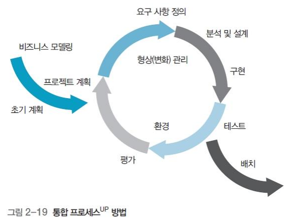

## 목차

1. [주먹구구식 모델](#주먹구구식-모델)
2. [폭포수 모델](#폭포수-모델)
3. [V 모델](#v-모델)
4. [진화적 프로세스 모델](#진화적-프로세스-모델)
5. [반복적 개발 방법론](#반복적-개발-방법론)
6. [References](#references)

 주먹구구식 모델 

## 주먹구구식 모델
공식적인 가이드라인이나 프로세스가 없는 개발 방식이다. 일단 코드를 작성하여 제품을 만들어본 후에 요구 분석, 설계, 유지보수에 대하여 생각한다.

### 절차

1. 첫 번째 버전의 코드를 작성하여 제품을 완성한다.
2. 작성된 코드에 문제점이 있으면 수정하여 해결한다.
3. 문제가 없으면 사용한다.

### 장단점
+ 개발자 한 명이 단시간에 마칠 수 있는 경우에 적합하다.

+ 코딩을 먼저 하므로 계속 수정할 가능성이 높은데, 여러 번 수정하다보면 프로그램의 구조가 나빠져 수정이 매우 어려워진다.
+ 프로젝트의 전체 범위를 가늠할 수 없고, 좋은 아키텍처를 만들 수 없다.
+ 일을 효과적으로 나눠 개발할 수 없고, 진척 상황을 알 수 없다.
+ 정해진 개발 순서나 각 단계별로 문서화된 산출물이 없어 관리 및 유지보수가 어렵다.

 폭포수 모델 

## 폭포수 모델
Waterfall 모델로 유명하다. 선형 순차적 모델, Linear squential 모델, Classic life cycle 라고도 한다. 계획 - 요구분석 - 설계 - 구현 - 테스트 - 유지보수 6단계의 절차를 거친다.

### 장단점
+ 쳬계적인 문서화로 관리가 용이하다.
+ 요구사항의 변화가 적은 프로젝트에 적합하다.

+ 각 단계는 앞 단계가 완료되어야 수행할 수 있다.
+ 각 단계의 결과물이 완벽한 수준으로 작성되어야 다음 단계에 오류를 넘겨주지 않는다.
+ 사용자가 중간에 가시적인 결과를 볼 수 없다.

 V 모델 

## V 모델
폭포수 모델에 테스트 단계를 추가적으로 확장한 것이다. 폭포수 모델은 산출물 중심인 것에 반해, V 모델은 각 개발 단계를 검증하는 데 초점을 둔다.

+ 단위 테스트: 개별 모듈을 검증한다.
+ 통합 테스트: 모듈 간의 인터페이스를 확인한다.
+ 시스템 테스트: 모듈이 모두 통합된 후, 사용자의 요구사항들을 만족하는지 확인한다.
+ 인수 테스트: 시스템이 예상대로 동작하고 요구 사항에 부합하는지 확인한다.

## 진화적 프로세스 모델
선형 순차적 모델은 사용자가 중간에 가시적인 결과를 볼 수 없다는 단점이 있다. 이러한 단점을 프로토타입을 통해 해결하고자 등장한 모델이다.

 프로토타입 모델 

## 프로토타입 모델
모델하우스처럼 시제품을 미리 제작해본다. 완전한 소프트웨어를 만들기 전에 사용자의 요구를 받아 일단 모형을 만들고, 이 모형을 사용자와 의사소통 하는 도구로 활용한다.

1. 요구사항을 정의하고 분석한다. 
2. 사용자와 대화할 수 있는 수준으로 프로토타입을 설계한다. 입출력 화면을 통한 사용자 인터페이스 중심으로 설계한다.
3. 프로토타입을 개발한다. 입출력을 통해 사용자 요구사항을 파악하는 것을 목표로 한다.
4. 사용자는 프로토타입을 평가한다. 추가 및 수정 요구가 생긴다면 1번으로 다시 돌아간다.
5. 최종 프로토타입을 개발한다.

### 실험적 프로토타입 모델
개발한 프로토타입을 최종적으로는 폐기하고, 완성품을 만든다. 프로토타입에서 최종 사용자 요구를 도출하면 그때부터 분석 - 설계 - 구현을 진행한다.

### 진화적 프로토타입 모델
개발한 프로토타입을 계속해서 수정하여 최종품으로 사용한다.

### 장단점
+ 사용자가 중간에 가시적인 결과를 확인하고 의사소통할 수 있는 도구가 생겼다.
+ 새로운 요구사항을 발견할 수 있다.
+ 반복된 과정을 통해 사용자 요구가 충분히 반영된 요구사항 명세서를 작성할 수 있다.
+ 완성품을 예측할 수 있다.

+ 반복적 개발을 통한 투입 인력 및 비용 산정이 어렵다.
+ 프로토타이핑 과정에 대한 통제 및 관리가 어렵다.
+ 중간 산출물을 생성해내기 애매하다.
+ 개발 범위가 불명확하므로 개발 종료와 목표가 불확실하다.

 나선형 모델 

## 나선형 모델
프로토타입 모델에 위험 분석 단계를 추가한다. 빈번히 변경되는 요구사항, 팀원들의 경험 부족, 팀워크 저하, 프로젝트 관리 부족 등 실제 개발 전 위험요소를 분석한다. 

1. 프로젝트를 계획하고 사용자 요구 분석을 한다.
2. 프로젝트의 위험 요소를 분석한다.
3. 프로토타입을 개발한다.
4. 사용자는 프로토타입을 평가한다.

### 장단점
+ 사전 위험 분석으로 돌출 위험 요소가 감소한다.
+ 프로젝트가 중단될 확률이 감소한다.
+ 사용자 평가에 의한 개발 방식이므로 요구가 충분히 반영되어, 불만이 감소한다.

+ 반복적 개발이므로 프로젝트가 연장될 수 있다.
+ 그리고 프로젝트 관리가 어렵다.
+ 위험 관리 전문가가 필요하다.

## 반복적 개발 방법론
폭포수 모델은 각 단계별로 깔끔하게 정리되어 있지만, 사용자의 요구사항이 많으면 민첩하게 대처할 수 없다. 이러한 문제점을 해결하기 위해 작업을 계속해서 반복 수행하는 방법론이다.

 통합 프로세스 

## 통합 프로세스

통합 프로세스 모델은 크게 도입 - 구체화 - 구축 - 전이 4단계로 나뉜다. 각 단계도 여러 개의 작은 단위로 나뉘어 각 반복 구간을 하나씩 정한다. 반복 전에 기준선 계획을 설립한다. 반복 주기가 끝나면 실행 가능한 산출물이 도출되며, 이걸 위험 요소 제거 여부를 판단하는데 사용한다. 반복 구간 하나가 수행될 때 전체 9개의 개발 영역이 대부분 수행된다.

### 도입 단계
준비, 인지, 시작, 발견, 개념 정립 등 다양한 이름으로 불린다. 비즈니스 모델링과 요구사항 정의 관련 작업이 가장 많이 이루어진다.

+ 개발의 기초가 되는 아이디어 도출
+ 프로젝트의 실현 가능성 및 사업의 타당성 확인
+ 프로젝트 개발 범위 파악

등 프로젝트에 대한 기초 설계를 탄탄히 한다.

### 구체화 단계
상세 단계, 정련 단계라고도 불린다. 보통 2 ~ 4개의 반복 단위로 구성된다. 분석 및 설계 작업이 크게 이루어진다. 설계 결과에 따른 구현 작업, 그리고 그에 대한 단위 테스트가 조금씩 시작된다.

### 구축 단계
구현 작업이 가장 많이 이루어진다. 인도 가능한 최초 실행 버전의 소프트웨어를 개발한다.

### 전이 단계
이행 단계라고도 하며 사용자를 위한 제품을 완성하는 단계이다. 완성된 제품을 사용자에게 넘겨주는 과정에서 수행해야할 일을 작업한다. 사용자 환경에서 사용자가 직접 테스트하는 인수 테스트 등을 진행한다.

### 공통
모든 단계에서 공통적으로 이루어지는 작업도 있다. 다만 각 단계별로 수행하는 정도에 차이가 있다. 그리고 각 작업 단계를 반복 수행하는 것이 통합 프로세스 모델의 가장 큰 특징이다. 

## References
* 2022 봄 소프트웨어공학 강의