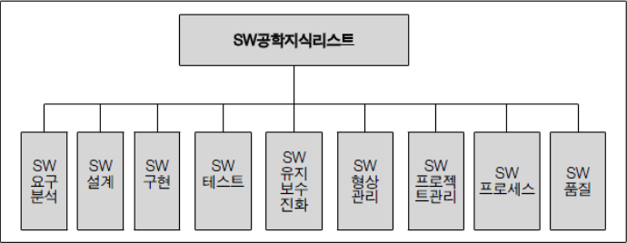

## 목차

1. [소프트웨어 개발과 관련된 질문들](#소프트웨어-개발과-관련된-질문들)
2. [소프트웨어공학이란?](#소프트웨어공학이란)
3. [References](#references)

## 소프트웨어 개발과 관련된 질문들
### 프로그램 개발 비용
소프트웨어 시스템을 개발하는 데 드는 비용 중, 프로그래밍에 드는 비용은 어느정도 인가?
+ 소프트웨어 개발의 경우, 전체 개발 비용의 약 20%가 건축의 시공에 해당되는 프로그래밍에 소요된다.
+ 요구사항 분석과 설계가 제대로 된다면 프로그래밍은 기계적인 일이다.
+ 약 40-50%의 개발 비용이 프로그래밍 이전 단계에 소요된다.
+ 따라서 요구사항 분석과 설계를 중요시해야 한다. 이들이 체계적으로 이루어지지 않으면 좋은 품질을 기대하기 어렵다.

### 프로그램 오류
사용자에게 배달되는 소프트웨어 시스템의 실행코드 1000줄 당 예상 되는 오류의 개수는?
+ 개발하는 과정에서 발견되는 오류는 1000줄 당 50-60개지만, 제품이 완료되어 배달된 후 발견되는 오류는 평균 4개 이하이다.
+ 출고 이전에 효과적으로 결함을 찾아내어 여과시키는 것은 소프트웨어의 품질보증을 위하여 필수적이다.
+ 생산성보다도 더 핵심적인 현안으로 다뤄진다. 오류의 발견이 늦어질수록 오류를 수정하는 비용이 대폭 증가하기 때문이다.
+ 따라서 초기부터 검증을 시작하고, 품질에 대한 전체 팀원의 노력, 품질에 초첨을 맞춘 환경을 조성해야한다.

### 개발과 유지보수 비용
소프트웨어 시스템을 유지, 보수하는데 드는 비용이 개발하는데 드는 비용의 몇 배 정도 될까?
+ 소프트웨어를 개발하는 비용에 비해 유지, 보수하는 관리 비용이 심하면 수십 배까지도 많이 들어간다. 
+ 하지만 개발하는 동안에는 유지보수 비용이 과소평가 되기 쉽다.
+ 유지보수 비용은 얼마나 체계적으로 만들었냐에 따라 줄어든다.

## 소프트웨어공학이란?
### 정의
어떻게 하면 생산성 높게 소프트웨어를 개발하고 품질을 보증하며, 사용자에게 만족감을 줄 수 있을 것인가를 연구하는 학문이다. 일반적으로 예정시간과 원가예측의 범위 안에서, 소프트웨어를 체계적으로 생산하고 유지보수하기 위한 기술적이며 관리적인 분야이다. 따라서 프로젝트를 진행하는 데 있어, 팀 단위의 활동계획과 의사소통 방법 등을 규정한다.   

### 등장배경
+ 소프트웨어 개발에 필요한 시간 및 비용 예측력 부족
    + 개발 초기 예상 비용과 시간보다 증가하는 경우가 흔하게 발생한다. 
+ 개발된 소프트웨어의 품질 수준 부족
    + 신뢰성 및 유지 보수의 용이 등 기본적인 품질을 만족시키는 소프트웨어를 만들지 못 한다. 
+ 유지 보수의 역할 증대
    + 생명주기가 길어지면서 증가한 유지보수 비용을 어떻게 줄일 수 있는지에 대한 문제가 발생한다. 
+ 하드웨어 및 소프트웨어 기술의 급속한 발전
+ 크고 복잡한 소프트웨어 시스템에 대한 수요 증가

앞으로 방법론을 다루면서 프로젝트에 대한 예측력, 품질 보장, 유지보수 비용 등을 핵심적으로 고려하자.

### 개발이 어려운 이유
+ 의견 교환

개발자들의 역할이 분석가, 설계자, 프로그래머, 테스터 등로 다양하게 세분화된다. 게다가 사용자 및 스폰서 등이 프로젝트에 참여하기 때문에 많은 사람들이 의견 교환을 한다. 더불어 개발할 소프트웨어에 대한 올바른 이해, 사용하는 표기법과 개발 기법 등에 대한 공통의 베이스를 갖지 않으면 제대로 시스템을 개발할 수 없다.
+ 소프트웨어의 순차적 개발
+ 프로젝트의 특성

소프트웨어가 개발되는 영역에 대한 지식 + 소프트웨어 개발에 영향을 미치는 요소(시스템 크기, 처리하는 데이터의 종류, 스폰서의 요구사항 변경, 동시 사용자수, 다른 시스템과의 연계) 이러한 것들을 결합하는 것이 어렵다.
+ 개인의 특성
+ 관리

개발비의 산정, 효율적인 일정 관리, 필요 자원의 확보, 영역 지식을 겸비한 프로젝트 관리자가 필요하다.     

### SW 공학 표준 커리큘럼

## References
* 2022 봄 소프트웨어공학 강의