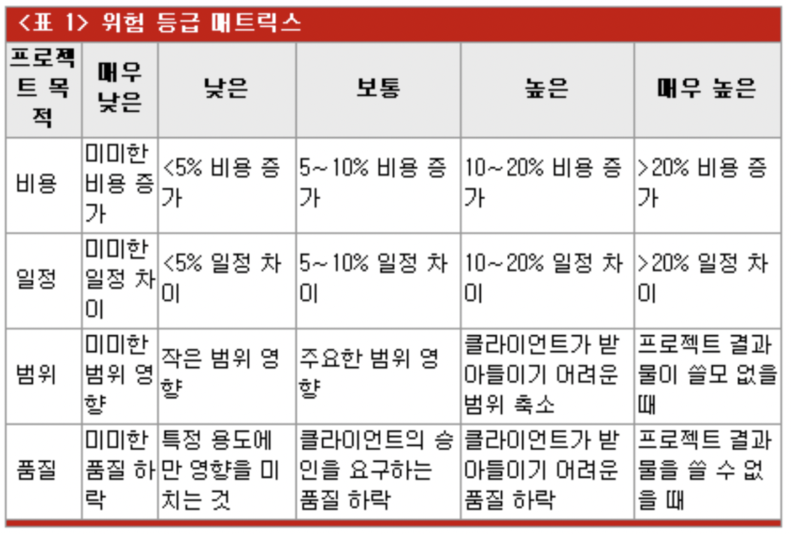

## 목차

1. [위험 관리](#위험-관리)
2. [위험 관리 프로세스](#위험-관리-프로세스)
3. [PMBOK 위험 관리 프로세스](#pmbok-위험-관리-프로세스)
4. [References](#references)

## 위험 관리
소프트웨어 팀이 앞으로의 개발에 대한 불확실성과 손실을 이해하고 관리해주는 단계이다. 역으로 프로젝트 실패에 대해서 고민해본다.

+ 불확실성: 리스크는 발생하든지 안 하든지 한다.
+ 손실: 리스크가 현실화되면 원하지 않는 결과 손실이 발생한다.

리스크 분석 시에는 다음을 고려해야 한다.

+ 프로젝트 리스크: 프로젝트 계획을 위협한다.
+ 기술 리스크: 생성될 소프트웨어의 품질과 적기성을 위협한다.
+ 비즈니스 리스크: 제작될 소프트웨어의 생존 가능성을 위협한다.
    + 아무도 원치 않는 제품이나 시스템의 제작
    + 비즈니스 전략에 맞지 않는 제품의 제작
    + 판매부서가 어떻게 팔지 모르는 제품의 제작
    + 초점의 변경이나, 사람이 바뀌어 더 이상 상급 경영자의 지원을 상실
    + 예산이나 인원 언질 상실

### 목적
+ 리스크를 적절히 관리하여 리스크에 대한 영향을 최소화시킨다.
+ 리스크를 적절히 관리하지 못하면 프로젝트는 실패할 수 있고, 막대한 비용이 든다.

프로젝트 위험은 곧 프로젝트 목적에 대한 위협과 더불어 프로젝트 목적 향상의 기회이다. 

## 위험 관리 프로세스
PMBOK(Project Management Body Of Knowlege)에 의해 정의된 6개 프로세스이다.

+ 위험관리 계획
+ 위험 식별
+ 정성적 위험 분석
+ 정량적 위험 분석
+ 위험응답 계획
+ 위험 감시 및 통제

SEI(Software Engineering Institute)의 위험 관리 프로세스이다.
+ 인식 
    + 프로젝트 성공에 부정적인 영향을 미칠 위험요소를 식별하는 단계이다.
+ 분석
    + 식별된 위험의 영향력, 발생가능성, 발생시점을 분석하여 우선순위를 정하는 단계이다.
+ 계획
    + 분석된 위험에 대한 접근전략 및 대응계획을 수립하는 단계이다.
+ 평가
    + 위험에 대한 시정조치 및 위험요소에 대한 모니터링 단계이다.
+ 통제
    + 계획에서 벗어난 위험에 대한 조정 혹은 위험의 마감 단계이다.

## PMBOK 위험 관리 프로세스

 PMBOK 위험 관리 프로세스 

### 위험 관리 계획
프로젝트를 위한 위험관리 활동들에 어떻게 접근하고 계획해야 하는지를 결정하는 프로세스이다.
1. 입력물
    + 프로젝트의 존재를 알리는 공식적인 문서를 필요로 한다.
    + 위험 관리 정책, 사전 정의된 역할과 책임, 이해관계자의 위험 허용 수준 등을 파악해야 한다.
2. 도구: 기획 회의
3. 출력물
    + 위험 관리 계획
    + 방법론
    + 역할 및 책임
    + 예산 수립
    + 시점
    + 점수화 및 해석
    + 시발점
    + 보고형식

### 위험 관리 식별
위험이 프로젝트에 미칠 수 있는 영향을 확인하고 그들의 특성을 문서화하는 것이다. 반복적 프로세스이다.

1. 입력물
    + 위험 관리 계획, 프로젝트 기획의 출력물, 위험 범주
    + 위험 식별을 위한 인터뷰, 설문조사, 회의 등의 방법이 있다.

2. 도구
    + 체크리스트: 다른 정보 원천 또는 축적된 지식에 기반을 두고 개발한다.
        + 위험 식별이 빠르고 단순하지만, 리스트를 철저하게 작성하는 거싱 불가능하다.
    + Fishbone diagram(원인과 영향)

3. 출력물
    + 트리거: 위험 징후, 경고 신호이다.

### 정성적 위험 분석
식별된 위험의 영향과 가능성을 평가하는 프로세스 이다.

1. 입력물
    + 위험 관리 계획, 식별된 위험, 프로젝트 현황 및 유형, 데이터 정밀도 등
    + 정량적 위험 분석에 있는 추가적인 분석을 이끌어내기도 하고, 곧바로 위험 응답 기획을 하기도 한다.

2. 도구
    + 확률/영향 위험 등급 매트릭스
        + 매우 낮은, 낮은, 보통, 높은, 매우 높은 이라는 단어를 활용해 위험 정도를 표기한다.

### 정량적 위험 분석
전체 프로젝트 위험의 크기 뿐만 아니라 프로젝트 목적에 대한 각각의 위험 확률 및 그것의 결과를 숫자로 나타내는 것이다. 프로젝트 위험 노출을 정량화하여, 필요한 비용과 일정(Schedule)의 비상 준비금 크기를 결정한다. 가장 큰 주의를 요하는 위험을 식별한다. 일반적으로 정성적 위험에 뒤이어 수행한다.

1. 입력물
    + 위험 관리 계획, 식별된 위험, 우선순위화된 위험 목록, 전문가 판단
2. 도구
+ 프로젝트 이해 관계자와 특정 분야의 전문가들과의 인터뷰
+ 시뮬레이션

3. 출력물
    + 정량화된 위험의 우선순위 목록, 확률적 분석 등

### 위험 응답 계획
프로젝트 목적에 대한 기회를 향상시키고 위협을 감소시키기 위한 선택권을 개발하고 행동을 결정하는 프로세스이다. 회피, 전가, 완화, 수용 4가지 위험 응답 테크닉이 있다.

1. 입력물
    + 위험 관리 계획, 우선순위화된 위험 목록, 프로젝트의 위험 등급, 정량화된 위험의 우선 순위 목록, 비용 및 시각 목적 달성의 확률, 위험 시발점, 위험 소유자

2. 출력물
    + 위험 응답 계획, 잔존 위험, 이차적 위험, 필요한 비상 준비금의 규모 등

#### 회피
프로젝트 초기에 위험을 제거하기 위해 또는 위험 영향으로부터 프로젝트 목적을 보호하기 위해 프로젝트 계획을 변경한다. 모든 위험 사건을 제거할 수 없어도 일부 특정 위험은 회피 가능하다.

+ 범위 감소, 자원과 시간 추가, 익숙한 방법 적용, 익숙하지 않은 하도급 업자 회피

#### 전가
위험의 결과를 제 3자에게 이동시키는 것이다. 단순히 관리 책임을 넘기는 것이지, 제거하는 것은 아니다. 위험을 받아들인 제 3자에 대한 위험 보상 지불을 포함한다. 보통 인력이나 기술력과 관련되어 있다.

+ 인력 부족: 인력 부서장에게 대응을 위임한다.
+ 기술력 부족: 아웃소싱을 한다. 이 때는 아웃소싱 업체의 고객이 된다. 아웃소싱 업체를 관리해야하는 필요성이 생긴다.

#### 완화
이 때부터는 위험을 받아들인다. 수용 가능한 시발점에 적대적인 위험 사건의 확률과 결과를 감소시킨다. 고객과의 의견 조율을 통해, 프로세스의 복잡성을 줄이거나 더 많은 기술적 테스트를 실시한다.

#### 수용
위험을 다루기 위해 또는 적당한 응답 전략을 식별하는 것이 불가능할 때, 프로젝트 계획을 변경하지 않음을 결정한다.

+ 능동적 수용: 위험 발생시, 실행할 비상 계획을 개발한다.
+ 수동적 수용: 아무 대처 없이 그대로 수용한다.

### 위험 감시 및 통제
식별된 위험을 추적하는 것, 잔존 위험을 감시하는 것, 새로운 위험을 식별하는 것 등을 포함하는 포로세스이다.

+ 위험 감시: Risk Status Report
    + 조치 계획의 이행 여부와 위험 수준의 변화

## References
* 2022 봄 소프트웨어공학 강의