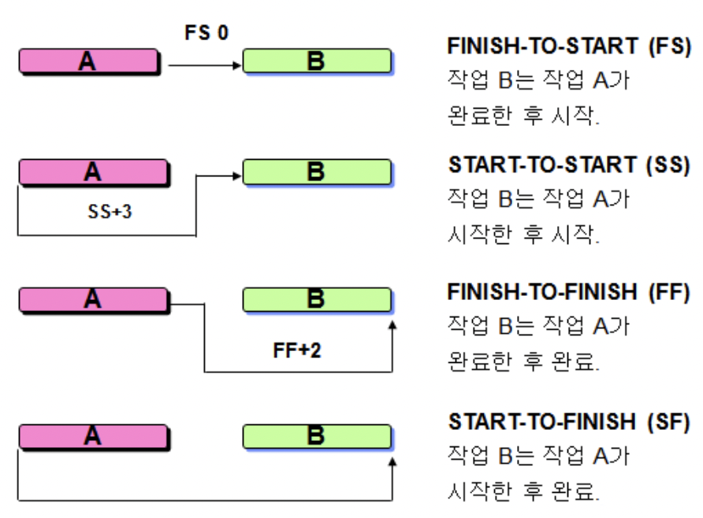
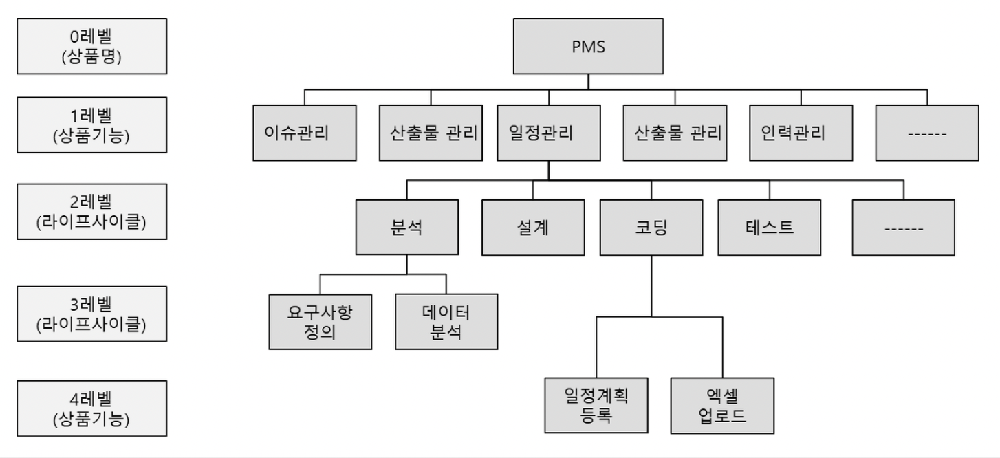
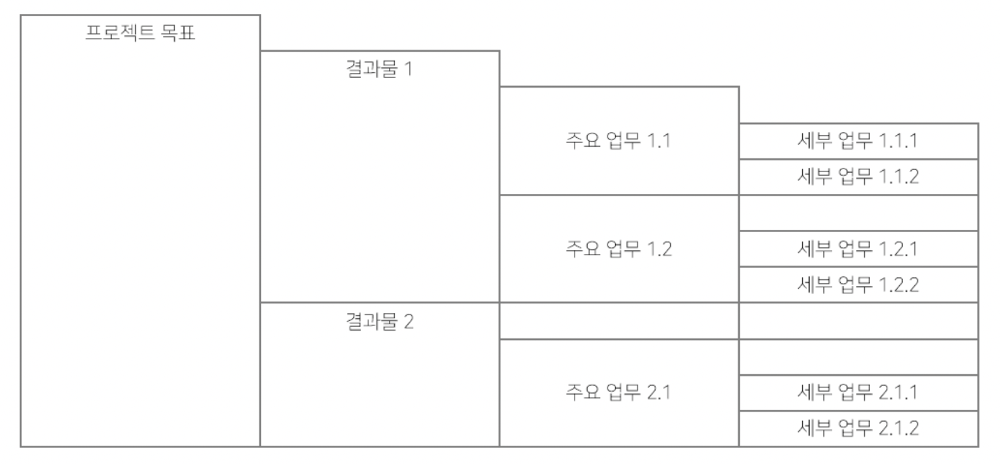

## 목차

1. [일정 관리](#일정-관리)
2. [WBS](#wbs)
3. [PERT/CPM](#pertcpm)
4. [Gantt 차트](#gantt-차트)
5. [References](#references)

## 일정 관리
프로젝트를 납기일 이내에 완료하기 위한 계획 수립 및 통제 활동을 포함한다.
모든 활동의 계획시작일과 계획종료일이 정의된 것을 일정이라고 한다. 이는 달력에 표시할 수 있어야 한다. 주 n일 근무, 일일 근무 시간, 출장 등을 고려한다.

+ 일정: 프로젝트 착수일 + 활동 연관관계 + 활동 수행기간

### 활동순서 배열
활동 사이의 논리적인 연관관계를 정의한 것으로, 주로 선후 관계로 표시한다. 선후 관계에는 FS, SS, FF, SF가 있다.

### CPM
Critical Path Method, 주공정법이라고 한다. 활동 수행기간의 총합이 가장 긴 경로를 의미한다. 강조를 위해서 다른 활동들과 색을 구별해서 표시한다.

## WBS
프로젝트 관리의 뿌리라고 할 수 있다. 프로젝트의 목표에 다다르기 위해 필요한 활동, 업무를 관리할 수 있을 정도로 세분화하는 일정분석 업무이다. 선행되어야 할 업무를 가려 일정을 분석한 결과라고 할 수 있다. 관리 영역의 계획을 수립하는 기초이다. 주로 업무 위주 WBS와 산출물 위주 WBS를 사용한다.

+ 프로젝트의 목표(Goal)
+ 프로젝트에 포함된 결과물(Outcome)
+ 결과물을 만들기 위한 주요 업무(Task)
+ 주요 업무를 쪼갠 세부 업무(Activity)

이들을 계층 형태로 표현하며, 각 항목에 따른 산출물(Output)을 관리한다. WBS는 본질적으로 도구이지, 목표가 아님을 명심한다.

### WBS 사전의 구성 내용
+ 작업 번호/작업 이름
+ 작업 설명
+ 선행작업 및 후행작업
+ 달성되어야 될 작업 내용
+ 산출물/목적
+ 책임자/참여자

### WBS 품질 판단 기준
워크 패키지라는 것을 통해 판단한다. 해당 업무의 담당자를 할당할 수 있을 정도로 작게 나눈 WBS의 최소 단위이다.

+ 각 워크패키지의 완료를 판단할 수 있어야 한다.
+ 각 워크패키지마다 산출물을 정의할 수 있어야 한다.
+ 각 워크패키지마다 원가, 일정, 자원을 신뢰성 있게 추정할 수 있어야 한다.
+ 워크패키지의 기간이 조직에서 정의한 상한선을 넘기지 않는 것이 바람직하다.

## PERT/CPM
WBS 상의 작업 순서, 소요기간, 기타 제반사항을 네트워크 형태로 표시함으로써, 주요 작업 및 일정의 여유를 갖는 작업을 산출해 중점 관리 대상 작업을 명확히 한다. 네트워크 다이어그램이라고도 한다.

## Gantt 차트
작업에 소요되는 시간을 동일한 폭으로 세로로 배열하고, 각각의 작업의 시작일과 종료일 사이의 공간을 막대 그래포 형태로 제시한다. 작업의 순서와 기간을 한 눈에 시각적으로 보여주는 형태이다.

## References
* 2022 봄 소프트웨어공학 강의